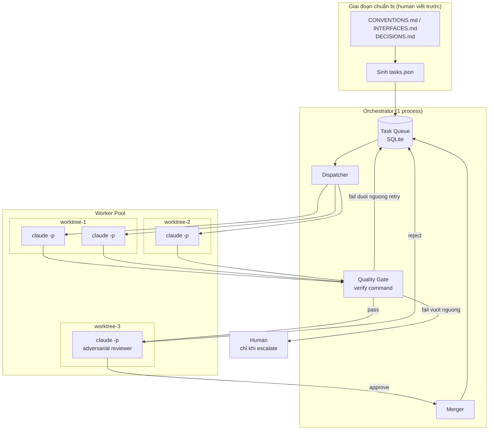
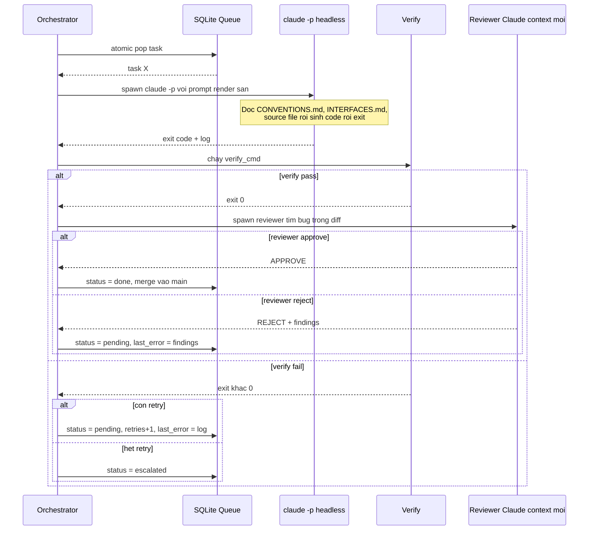
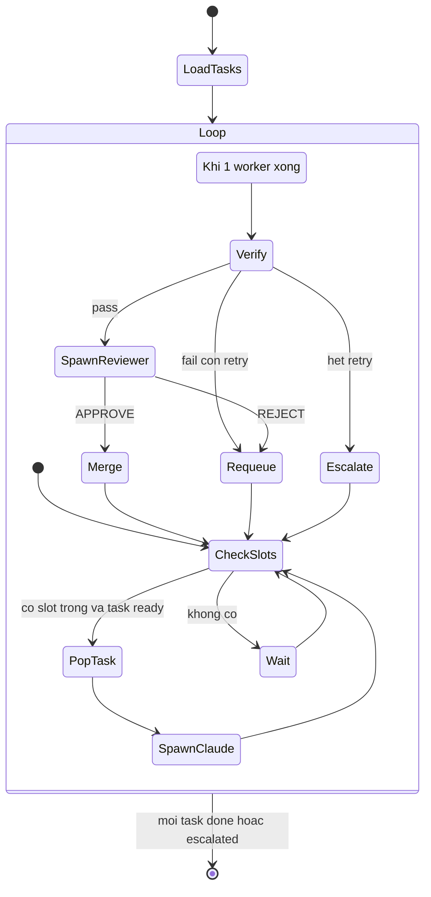

Tôi từng đưa Claude Code một plan dài — kiểu "port module A, rồi B, rồi C, chạy test, fix lỗi, tiếp module D". Nó chạy được vài bước rồi dừng lại hỏi: "Bạn có chắc muốn tôi sửa file này không?" Tôi confirm, nó chạy tiếp, rồi lại dừng hỏi tiếp câu khác. Momentum vậy là mất — tôi ngồi canh màn hình để bấm "yes" thay vì đi làm việc khác.

Rồi tôi đọc bài [Bun in Rust](https://bun.com/blog/bun-in-rust) của Jarred Sumner: anh ấy port toàn bộ Bun từ Zig sang Rust trong **11 ngày** — 6.502 commits, ~1 triệu dòng code, ~$165.000 chi phí API, và tiện tay fix luôn 128 bug cũ. Câu hỏi đầu tiên của tôi là: làm sao Claude không bị ngắt giữa chừng suốt 11 ngày đó?

Câu trả lời không phải là "1 session dài chạy liên tục". Đó là **~64 Claude instances chạy song song trên 4 git worktree** — mỗi instance nhận một task nhỏ, làm xong thì exit, verify tự động, rồi worktree khác spawn instance kế tiếp. Không có ai đứng đó bấm "yes" cả.

Tôi viết tài liệu thiết kế lại pattern này thành một orchestrator tối giản, tự chạy được trên máy mình. Bài này là phần giải thích — kèm sơ đồ, schema, và những rủi ro tôi nghĩ đáng lưu ý trước khi ai đó (kể cả tôi) áp dụng nó cho dự án thật.

## Vì sao Claude hỏi confirm giữa chừng

Claude hỏi khi nó **thiếu ngữ cảnh để tự quyết định**, hoặc khi task quá rộng nên nó không chắc phạm vi. Một session dài chứa nhiều quyết định nhỏ — đổi tên field, chọn lib, xử lý edge case — và mỗi quyết định là một điểm có thể dừng lại chờ người.

Bun giải quyết bằng cách loại bỏ chính những điểm dừng đó **trước khi chạy**, không phải xử lý chúng lúc chạy:

- `PORTING.md` — mapping từng pattern Zig → Rust tương đương, Claude không cần đoán cách dịch.
- `LIFETIMES.tsv` — bảng lifetime cho từng struct field, Claude không cần hỏi "field này sống bao lâu?".
- Port **cơ học**, không refactor — không có chỗ cho "cải tiến" cần approve.

Và quan trọng hơn: mỗi Claude instance chỉ làm **một việc rất nhỏ** rồi exit. Không có task nào đủ dài để tích lũy nhiều điểm mơ hồ.

## Nguyên tắc cốt lõi: stateless worker, orchestrator giữ state

Đây là điểm khác biệt lớn nhất so với cách tôi từng dùng Claude Code — chat một session dài, kỳ vọng nó "nhớ" toàn bộ kế hoạch.

| Nguyên tắc                           | Ý nghĩa                                                                                |
| ------------------------------------ | -------------------------------------------------------------------------------------- |
| Claude instance **stateless**        | Nhận prompt + tài liệu → sinh code → exit. Không giữ state giữa các lần chạy.          |
| Orchestrator giữ **toàn bộ state**   | Queue, status, retry count, worker assignment — tất cả nằm ngoài Claude, trong SQLite. |
| Giao tiếp qua **filesystem + queue** | Không share memory. Worktree là sandbox, SQLite là kênh điều phối duy nhất.            |
| **Verify bằng máy**, không bằng lời  | Task chỉ "done" khi verify command exit 0 — không tin lời Claude nói "đã xong".        |
| Human là **exception handler**       | Chỉ can thiệp khi retry vượt ngưỡng hoặc reviewer flag lỗi không tự xử được.           |

Nói cách khác: bí quyết không nằm ở prompt thần thánh nào cả. Nó nằm ở việc **không để Claude giữ trạng thái của cả pipeline trong đầu nó** — vì trạng thái đó chính là thứ khiến nó phải hỏi lại khi không chắc.

## Kiến trúc tổng thể



Ba lớp làm việc cùng nhau: tài liệu chuẩn bị sẵn (để Claude không cần hỏi), orchestrator giữ state (để không mất tiến độ khi 1 task fail), và một worker pool nơi mỗi Claude instance chỉ sống đủ lâu để làm xong 1 task rồi biến mất.

## Task phải atomic — đơn vị chia là gì

Tiêu chí để một task được đưa vào queue:

- Làm xong trong **1 lần chạy** `claude -p` — ước lượng dưới 30 phút, dưới 1 context window.
- **Không cần state chia sẻ** với task khác đang chạy song song — chỉ phụ thuộc task đã _done_.
- Có **verify command riêng** — test có mục tiêu, không phải full build.
- Đơn vị chia gợi ý: 1 file, 1 module nhỏ, hoặc 1 function cluster.

```jsonc
// tasks.json
{
  "id": "port-http-response",
  "prompt_template": "port",
  "inputs": {
    "source": "src/http/response.zig",
    "target": "crates/http/src/response.rs",
  },
  "depends_on": ["port-http-types"],
  "verify": "cargo test -p http response::",
  "max_retries": 3,
  "role": "implement",
}
```

`depends_on` là lý do task chạy được song song mà không tự đá nhau — dispatcher chỉ pop task khi mọi dependency đã `done`, và atomic pop trong SQLite đảm bảo hai worker không bao giờ lấy trùng task:

```sql
UPDATE tasks SET status='running', worker_id=?, updated_at=?
WHERE id = (
  SELECT t.id FROM tasks t
  WHERE t.status='pending'
    AND NOT EXISTS (
      SELECT 1 FROM json_each(t.depends_on) d
      JOIN tasks dep ON dep.id = d.value
      WHERE dep.status != 'done'
    )
  LIMIT 1
)
RETURNING *;
```

SQLite ở chế độ WAL + 1 process orchestrator duy nhất là đủ, không cần lock phức tạp.

## Vòng đời một task



Điểm mấu chốt nằm ở nhánh `verify fail` khi còn retry: `last_error` được ghi lại và **đưa vào prompt của lần chạy kế tiếp**. Claude không tự nhiên "nhớ" nó đã fail — orchestrator phải nhồi ngữ cảnh đó vào lại, vì mỗi instance là stateless.

## Prompt template — biến câu hỏi thành dữ liệu

Đây là phần tôi nghĩ quan trọng nhất để trả lời câu hỏi gốc: "làm sao không bị hỏi giữa chừng". Prompt cấm Claude hỏi, và cho nó một escape hatch không phải là con người:

```markdown
## Quy tắc

- KHÔNG hỏi câu hỏi. Mọi thông tin cần thiết đã có trong 3 file ngữ cảnh
  (CONVENTIONS.md, INTERFACES.md, DECISIONS.md).
  Nếu thực sự thiếu thông tin, ghi rõ vào file BLOCKED.md rồi exit —
  orchestrator sẽ xử lý.
- KHÔNG commit — orchestrator sẽ commit sau khi verify pass.

{{#if last_error}}

## Lần chạy trước đã FAIL với lỗi sau — phân tích và tránh lặp lại:

{{last_error}}
{{/if}}
```

`BLOCKED.md` là chi tiết dễ bỏ qua nhưng mang cả pipeline: một câu hỏi mà Claude _có thể_ hỏi giờ trở thành một dòng trong file mà orchestrator **đọc được bằng script**, thay vì một prompt chờ người gõ "yes" vào terminal. Quy tắc viết tài liệu ngữ cảnh cũng ngược lại: mọi câu Claude có thể hỏi phải có câu trả lời sẵn trong 3 file đó — nếu lúc chạy nó vẫn hỏi, nghĩa là tài liệu thiếu, bổ sung rồi retry, không phải đứng ra trả lời trực tiếp.

## Adversarial reviewer — tách biệt để không tự lừa mình

Verify pass không có nghĩa là logic đúng — test có thể pass vì test cũng sai, hoặc thiếu case. Nên sau verify, orchestrator spawn thêm một Claude khác:

- Chạy trong **context window hoàn toàn mới** — không biết gì về quá trình implement, nên không bị bias "code này chắc đúng vì tôi vừa viết nó".
- Input: `git diff main...task/X` + INTERFACES.md + CONVENTIONS.md.
- Output bắt buộc JSON: `{"verdict": "APPROVE" | "REJECT", "findings": [...]}` — orchestrator parse được, không cần người đọc.
- Chỉ tìm memory/logic bug, vi phạm interface, side effect ngoài scope — không comment style, linter đã lo phần đó.

Đây cũng chính là cơ chế tôi mô tả trong bài về [hai gọng kiềm ngược chiều buộc agent tự phá plan](/posts/hai-gong-kiem-agent-plan/): reviewer chỉ có giá trị khi nó độc lập thật, không phải cùng agent tự chuyển sang "critic mode".

## Vòng lặp chính của orchestrator



Chương trình kết thúc khi queue rỗng, in báo cáo done / escalated / tổng thời gian / tổng số lần chạy. Không có bước nào trong vòng lặp này chờ người — người chỉ xuất hiện ở nhánh `Escalate`, đọc `ESCALATED.md`, rồi quyết định.

## Công thức tóm gọn

Nếu chỉ nhớ một đoạn từ bài này:

```
Chuẩn bị: CONVENTIONS.md + INTERFACES.md + DECISIONS.md
          (mọi câu Claude có thể hỏi phải có câu trả lời ở đây)
Chia:     mỗi file/module nhỏ = 1 task atomic, có depends_on rõ
Queue:    SQLite WAL, atomic pop theo dependency graph
Worker:   claude -p --dangerously-skip-permissions trong worktree riêng
Verify:   test có mục tiêu, tự động, retry kèm last_error làm context
Review:   spawn adversarial Claude context mới, output JSON verdict
Escape:   Claude không hỏi người — ghi BLOCKED.md rồi exit
Merge:    orchestrator merge tuần tự, không confirm người ở giữa
```

## Rủi ro cần lưu ý trước khi áp dụng

Pattern này mạnh, nhưng không miễn phí:

| Rủi ro                                               | Giảm thiểu                                                                                                         |
| ---------------------------------------------------- | ------------------------------------------------------------------------------------------------------------------ |
| `--dangerously-skip-permissions` chạy lệnh nguy hiểm | Chỉ chạy trong worktree cách ly; deny-list `rm -rf`, `git push`, network ngoài trong settings                      |
| Verify pass nhưng logic sai                          | Adversarial reviewer + test assertions phải có sẵn trước khi chạy task, không phải Claude tự viết test rồi tự pass |
| 2 task sửa cùng file → conflict                      | Task khai báo rõ file scope; dispatcher không chạy song song 2 task trùng file                                     |
| Retry loop vô hạn tốn tiền                           | `max_retries` cứng + budget cap — dừng cả pipeline khi vượt ngưỡng chi phí                                         |
| Reviewer trả JSON không parse được                   | Bắt buộc format JSON, retry parse 1 lần, fallback REJECT nếu vẫn hỏng                                              |

Và rủi ro lớn nhất không nằm trong bảng: chi phí là tiền thật trên mỗi lần chạy. Bun tốn $165.000 cho 11 ngày với ~64 instance song song. Nếu áp dụng pattern này, tôi sẽ bắt đầu với 5-10 task nhỏ để đo chi phí/task trước, không nhảy thẳng vào scale lớn.

## Vậy còn plan dài của tôi thì sao

Quay lại câu hỏi ban đầu: không phải Claude Code "kém" ở việc chạy dài — mà một session dài buộc nó phải mang theo toàn bộ trạng thái quyết định trong đầu, và bất cứ điểm mơ hồ nào cũng trở thành lý do để hỏi. Cách Bun né được điều đó là chẻ plan dài thành nhiều task ngắn, atomic, độc lập, rồi để một orchestrator bên ngoài — không phải Claude — giữ toàn bộ trạng thái của cả pipeline.

Tôi chưa chạy hết cả 4 milestone của thiết kế này trên một dự án thật, nhưng M1 (queue SQLite + spawn 1 worker tuần tự + verify) đủ nhỏ để thử trong một buổi tối — và đó là cách tôi sẽ kiểm chứng phần còn lại của bài viết này, không phải chỉ đọc lý thuyết.
