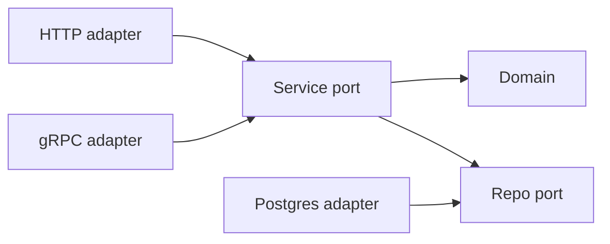
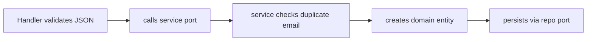

I do not reach for clean architecture because I like diagrams. I reach for it when a Go service will live long enough that its first database, transport, and package layout all turn out wrong.

That is `go-scaffolding`: keep the domain central, push everything external to the edge. One rule — business code never knows whether HTTP, gRPC, a CLI, or a worker called it.



The arrows only point inward, toward the domain. That is the whole trick: without it, transport concerns leak into service methods and service methods leak into queries, and untangling that later is expensive.

### Feature slices, not layer folders

Feature slices make the rule visible in the tree:

```text
internal/
└── user/
    ├── domain/
    ├── ports/
    ├── service/
    └── adapters/
        ├── postgres/
        └── http/
```

I prefer this over a global `handlers/`, `services/`, `repositories/` split: changing user behavior keeps me under `internal/user`, with domain, contracts, use cases, and adapters in one place. No cross-directory hunting.

### The domain knows nothing external

The domain package has validation and business rules — but no Gin, no GORM, no config loader. Plain Go, so tests run fast and never touch the network.

```go
// internal/user/domain/user.go
func NewUser(email, name string) (*User, error) {
	if !isValidEmail(email) {
		return nil, ErrInvalidEmail
	}

	name = strings.TrimSpace(name)
	if err := isValidName(name); err != nil {
		return nil, err
	}

	now := time.Now()
	return &User{
		ID:        uuid.New().String(),
		Email:     email,
		Name:      name,
		CreatedAt: now,
		UpdatedAt: now,
	}, nil
}
```

### Ports as contracts

Ports define what the feature may depend on. The repository is an output port: the service needs persistence, not the knowledge that PostgreSQL is behind it.

```go
// internal/user/ports/repository.go
type UserRepository interface {
	Create(ctx context.Context, user *domain.User) error
	GetByID(ctx context.Context, id string) (*domain.User, error)
	GetByEmail(ctx context.Context, email string) (*domain.User, error)
	Update(ctx context.Context, user *domain.User) error
	Delete(ctx context.Context, id string) error
	List(ctx context.Context, limit, offset int) ([]*domain.User, error)
}
```

The interface lives next to the service, not the adapter — so I can fully test the service before a line of PostgreSQL exists.

### The service layer

This is the part I care about most in tests. Duplicate-email handling, entity creation, and persistence all check against a mock repository — no database booted.

```go
func (s *UserService) CreateUser(ctx context.Context, email, name string) (*domain.User, error) {
	_, err := s.repo.GetByEmail(ctx, email)
	if err == nil {
		return nil, domain.ErrDuplicateEmail
	}
	if !errors.Is(err, domain.ErrUserNotFound) {
		return nil, err
	}

	user, err := domain.NewUser(email, name)
	if err != nil {
		return nil, err
	}

	if err := s.repo.Create(ctx, user); err != nil {
		return nil, err
	}

	return user, nil
}
```

### HTTP as an adapter, not the owner

HTTP is an adapter, not the owner. The handler binds JSON, calls the service port, and maps domain errors to status codes — no business decisions.

```go
func (h *UserHandler) CreateUser(c *gin.Context) {
	var req CreateUserRequest

	if err := c.ShouldBindJSON(&req); err != nil {
		c.JSON(http.StatusBadRequest, ErrorResponse{Error: err.Error()})
		return
	}

	user, err := h.userService.CreateUser(c.Request.Context(), req.Email, req.Name)
	if err != nil {
		statusCode, errorMsg := mapDomainErrorToHTTP(err)
		c.JSON(statusCode, ErrorResponse{Error: errorMsg})
		return
	}

	c.JSON(http.StatusCreated, ToUserResponse(user))
}
```

Each step in `CreateUser` crosses a boundary on purpose.



### The honest tradeoff

It costs files. More than a quick CRUD service needs, and the first setup feels like overhead. The payoff is later: add an adapter, swap persistence, or test use cases without dragging infrastructure into every assertion.

The point is not abstract Go. It is keeping the parts that change from owning the parts that matter — the same instinct behind [the subprocess library I wrote](/posts/subprocess-go-library): a narrow surface over a real primitive, sharp edges left visible.
