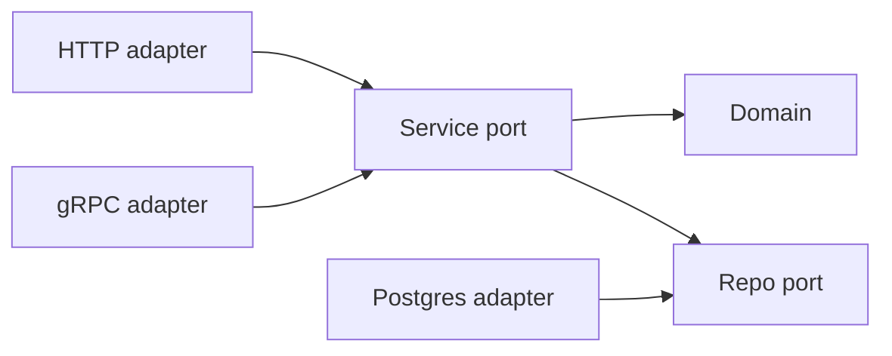
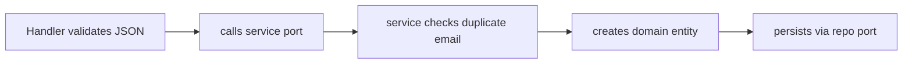

I do not reach for clean architecture because I like diagrams. I reach for it when I expect a Go service to live long enough that the first version of its database, transport, and package layout will eventually be wrong.

That is the reason behind `go-scaffolding`. It is a template for services where the domain is kept boring and central, and everything external is pushed to the edge.

> **Key Takeaways**
> - Feature-slice layout keeps domain, ports, service, and adapters co-located under one `internal/<feature>/` path — changing user behavior means staying in one directory.
> - The domain package contains zero framework imports (no Gin, no GORM), so core business rules are testable with plain Go and a mock repository.
> - Ports are Go interfaces owned by the feature, not by the adapter. Swapping PostgreSQL for another backend touches exactly one adapter directory.

## The practical rule

The README describes `go-scaffolding` as hexagonal architecture with a feature-sliced structure, but the practical rule is simpler: business code should not know whether it is being called by HTTP, gRPC, a CLI, or a worker.



Without that constraint, transport concerns creep into service methods, and service methods creep into repository queries. By the time the codebase is large enough to feel the pain, untangling it is expensive.

## The repository layout

Feature slices make the transport-agnostic rule visible in the directory tree:

```text
internal/
└── user/
    ├── domain/
    ├── ports/
    ├── service/
    └── adapters/
        ├── postgres/
        └── http/
```

I prefer this over a global `handlers/`, `services/`, `repositories/` split because the feature stays together. If I am changing user behavior, I can stay under `internal/user` and see the domain, contracts, use cases, and adapters in one place. No cross-directory hunting.

## The domain package

The domain package is where the service earns its boundaries. It has validation and business rules, but no Gin, no GORM, no config loader. Everything in here is plain Go, which means tests run fast and never touch the network.

```go
// internal/user/domain/user.go
type User struct {
	ID        string
	Email     string
	Name      string
	CreatedAt time.Time
	UpdatedAt time.Time
}

func NewUser(email, name string) (*User, error) {
	if !isValidEmail(email) {
		return nil, ErrInvalidEmail
	}

	name = strings.TrimSpace(name)
	if err := isValidName(name); err != nil {
		return nil, err
	}

	now := time.Now()
	return &User{
		ID:        uuid.New().String(),
		Email:     email,
		Name:      name,
		CreatedAt: now,
		UpdatedAt: now,
	}, nil
}
```

## Ports as contracts

The ports package defines what the rest of the feature is allowed to depend on. The repository is an output port: the service needs persistence, but it does not need to know that PostgreSQL is behind it.

```go
// internal/user/ports/repository.go
type UserRepository interface {
	Create(ctx context.Context, user *domain.User) error
	GetByID(ctx context.Context, id string) (*domain.User, error)
	GetByEmail(ctx context.Context, email string) (*domain.User, error)
	Update(ctx context.Context, user *domain.User) error
	Delete(ctx context.Context, id string) error
	List(ctx context.Context, limit, offset int) ([]*domain.User, error)
}
```

Because the interface lives next to the service — not next to the adapter — you can write and fully test the service before a single line of PostgreSQL code exists.

## The service layer

The service uses that port. This is the part I care about most in tests: duplicate email handling, entity creation, and persistence orchestration can be tested with a mock repository without booting a database.

```go
type UserService struct {
	repo ports.UserRepository
}

func NewUserService(repo ports.UserRepository) ports.UserService {
	return &UserService{repo: repo}
}

func (s *UserService) CreateUser(ctx context.Context, email, name string) (*domain.User, error) {
	_, err := s.repo.GetByEmail(ctx, email)
	if err == nil {
		return nil, domain.ErrDuplicateEmail
	}
	if !errors.Is(err, domain.ErrUserNotFound) {
		return nil, err
	}

	user, err := domain.NewUser(email, name)
	if err != nil {
		return nil, err
	}

	if err := s.repo.Create(ctx, user); err != nil {
		return nil, err
	}

	return user, nil
}
```

## HTTP as an adapter, not the owner

HTTP then becomes an adapter, not the owner of the application. The handler binds JSON, calls the service port, and maps domain errors to status codes. It does not make business decisions.

```go
func (h *UserHandler) CreateUser(c *gin.Context) {
	var req CreateUserRequest

	if err := c.ShouldBindJSON(&req); err != nil {
		c.JSON(http.StatusBadRequest, ErrorResponse{Error: err.Error()})
		return
	}

	user, err := h.userService.CreateUser(c.Request.Context(), req.Email, req.Name)
	if err != nil {
		statusCode, errorMsg := mapDomainErrorToHTTP(err)
		c.JSON(statusCode, ErrorResponse{Error: errorMsg})
		return
	}

	c.JSON(http.StatusCreated, ToUserResponse(user))
}
```

The `CreateUser` path stays easy to reason about because each step crosses a boundary on purpose.



## The honest tradeoff

This structure has a cost. There are more files than a quick CRUD service needs, and the first setup feels like overhead. The payoff shows up later, when you can add another adapter, replace persistence, or test use cases without dragging infrastructure into every assertion.

The template is not trying to make Go abstract. It is trying to keep the parts that change from owning the parts that matter.

---

## FAQ

**Why feature slices instead of a layered `handlers/services/repositories` split?**

A layered layout groups code by technical role, not by the problem it solves. Adding a feature means touching three or four directories. With feature slices, you stay under one directory and see the full picture of that feature in one place.

**What does "framework-free domain" actually mean in practice?**

The domain package imports only the Go standard library and a UUID generator — no Gin, no GORM, no wire. Unit tests are instant and require no mocks for framework internals, only for the repository interface.

**When is this structure overkill?**

When the service is small enough that the domain fits in one file and the transport is unlikely to change. This pattern earns its complexity only when the service is expected to grow or have multiple adapter types over time.

**How do cross-feature dependencies work?**

They go through ports, not direct package imports. If the user feature needs billing data, it depends on a `BillingPort` interface, not the billing package directly. This keeps compilation boundaries clean and prevents circular imports.
