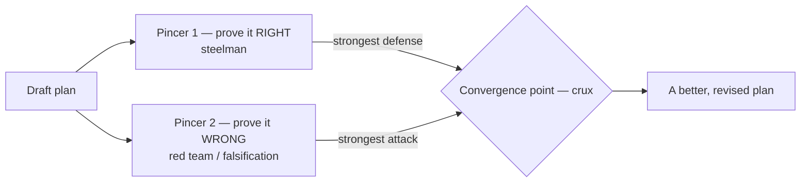
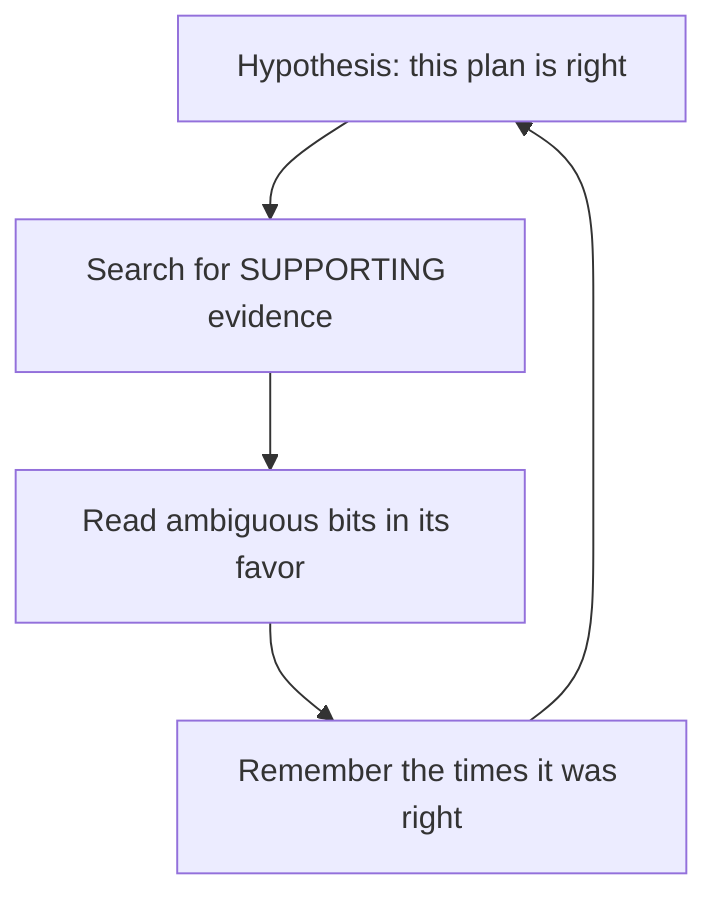
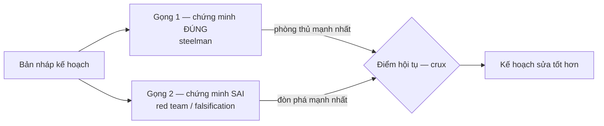
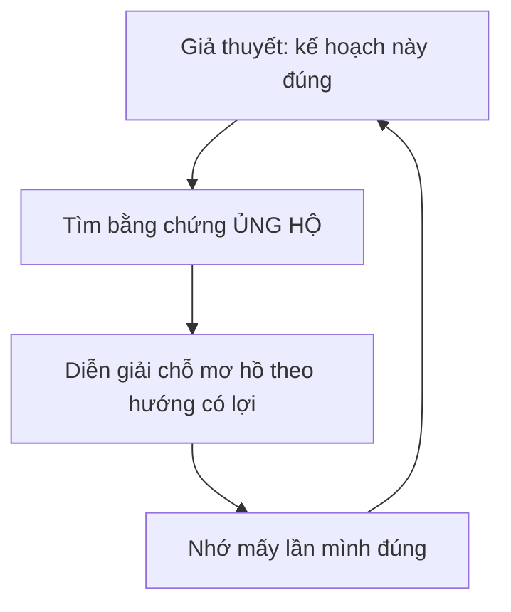

> Bài viết song ngữ. Bản tiếng Anh trước, bản tiếng Việt ở dưới.

A friend of mine noticed that Claude's planning workflow usually tries to prove itself right. It writes a draft plan, reviews that same plan, and decides it's fine. Every agent I run does this.

The problem is that checking your own work is hard. When I review my own plan I'm not neutral. I already want it to be right, so I go looking for reasons it works instead of reasons it breaks. That's confirmation bias, and you can measure it in an LLM too.

So instead of one self-review step, I set up two opposing pincers around the draft.



### Why self-review goes blind

Wason's 2-4-6 task is the classic example. People test a guess by looking for cases that confirm it, not cases that break it. But the only way to find the actual rule is to try something that could prove you wrong.

An agent reviewing its own plan does the same thing. Ask it to prove the plan is right and it goes off to collect supporting evidence, then reads anything ambiguous in its own favor. It turns into a loop:



### The two pincers

Pincer one proves the plan right. This is a steelman: build the strongest version of the plan you can, the best case for it. Not cheerleading, actual hard arguments in its favor.

Pincer two proves the plan wrong. This is the red team, or Popper's falsification if you want the fancy word: try hard to break it. A plan that survives a real beating is worth a lot more than one that just got approved.

One catch, and it's the important one. Pincer two only works if it's actually independent. An agent that just flips into "critic mode" is still carrying the same blind spots it had a second ago. So I run pincer two as a separate subagent with its own context, blind to whatever pincer one argued. It's the same reason I [run agents in parallel as separate processes](/posts/parallel-coding-agents-without-babysitting/) instead of one thread doing everything.

### Read only the convergence point

Here's the useful part. I don't read the whole plan. I read the one spot where pincer one says "fine" and pincer two says "broken" about the same assumption.

```
wrong  ───────►  convergence  ◄───────  right
```

That assumption is the crux: change it and the conclusion changes with it. All the signal is there. The arguing around the edges I skip.

I'm not trying to get a yes or no out of this either. The two sides collide on the crux, it surfaces an assumption I didn't know I was making, and I fix the plan. The goal isn't to pick a winner, it's to end up with a better plan. Better plan, and I only had to read the middle.

---

## Tiếng Việt

Một bạn tôi nhận ra workflow planning của Claude rất hay tự đi chứng minh nó đúng. Nó viết draft plan, tự review chính bản đó, rồi bảo ổn. Tôi chạy agent nào cũng thấy bệnh này.

Vấn đề rất đời: tự soi việc của mình khó. Khi tôi review plan của chính tôi, tôi không trung lập. Trong đầu tôi đã muốn nó đúng. Thế là tôi đi nhặt lý do để nó chạy được, chứ không đào lý do làm nó gãy. Đó là confirmation bias. LLM cũng dính, không có gì lạ.

Vì vậy tôi bỏ kiểu một bước tự review. Tôi kẹp draft plan bằng hai gọng kiềm ngược chiều.



### Vì sao tự review bị mù

Bài 2-4-6 của Wason là ví dụ kinh điển. Người ta có một phỏng đoán, rồi hay đi tìm ví dụ xác nhận phỏng đoán đó. Ít ai chịu thử thứ có thể làm nó sai. Nhưng muốn tìm ra luật thật thì phải làm đúng việc đó.

Agent tự review plan cũng vậy. Bảo nó chứng minh plan đúng thì nó đi gom bằng chứng ủng hộ. Chỗ nào mơ hồ, nó đọc theo hướng có lợi cho plan. Thế là thành một vòng lặp:



### Hai gọng

Gọng một chứng minh plan đúng. Đây là steelman: dựng phiên bản mạnh nhất của plan, rồi đưa ra lý lẽ cứng nhất để bênh nó. Không phải khen cho có. Phải thật sự cãi cho nó.

Gọng hai chứng minh plan sai. Đây là red team, hoặc nếu muốn gọi đúng sách vở thì là falsification kiểu Popper: cố hết sức đập cho nó gãy. Một plan sống sót qua cú đập thật đáng tin hơn nhiều so với plan chỉ được gật đầu cho qua.

Có một điểm phải làm nghiêm. Gọng hai chỉ có tác dụng nếu nó độc lập thật. Một agent vừa mới viết plan rồi tự chuyển sang "critic mode" vẫn mang theo cùng context, cùng giả định, cùng điểm mù. Nó tưởng đang phản biện, nhưng nhiều khi chỉ là tự diễn vai phản biện.

Nên tôi cho gọng hai chạy bằng một subagent riêng, context riêng, không thấy gọng một đã bênh gì. Cũng là lý do tôi [chạy agent song song bằng nhiều process tách biệt](/posts/parallel-coding-agents-without-babysitting/) thay vì nhét hết vào một luồng.

### Chỉ đọc điểm hội tụ

Phần đáng tiền nằm ở đây. Tôi không đọc cả plan. Tôi đọc đúng chỗ gọng một nói "ổn" còn gọng hai nói "gãy" trên cùng một giả định.

```
sai  ───────►  điểm hội tụ  ◄───────  đúng
```

Giả định đó là crux. Đổi nó thì kết luận đổi theo. Tín hiệu nằm ở đó. Mấy đoạn hai bên cãi vòng ngoài thì tôi bỏ.

Tôi cũng không dùng cách này để lấy một verdict đúng hay sai. Hai bên va vào crux, nó lòi ra giả định mà tôi không biết là mình đang dùng, rồi tôi sửa plan. Mục tiêu không phải chọn bên thắng, mà là có một plan tốt hơn. Tôi chỉ đọc đúng đoạn giữa.
