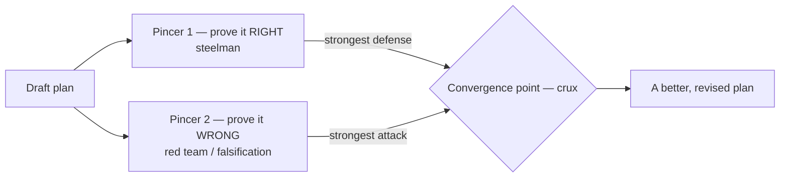
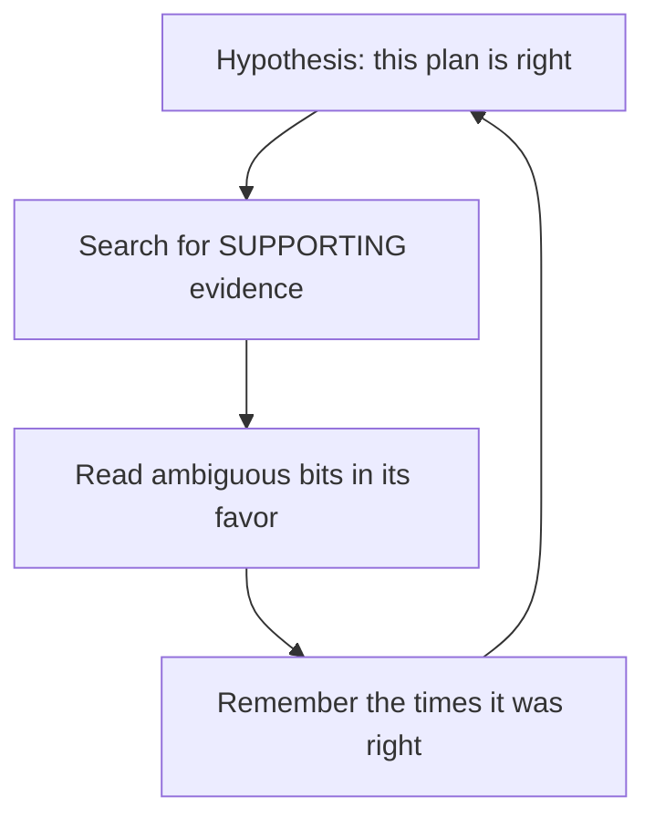
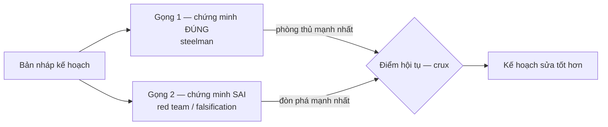
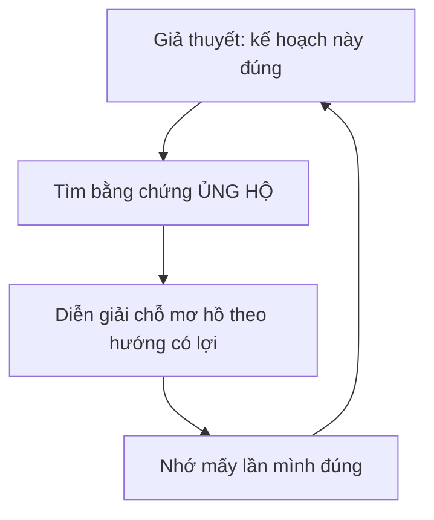

> Bài viết song ngữ — bản tiếng Anh trước, bản tiếng Việt ở dưới.

A friend pointed out something about Claude's planning workflow: it tends to go _prove itself right_. It writes a draft plan, reviews its own plan, then nods — "looks good". I see the same thing in every agent I run.

The problem is that one brain checking itself is terrible at it. When I review my own plan I'm not neutral — I already want it to be right. So instead of hunting for where it breaks, I gather evidence that it holds. That's confirmation bias, and it's measurable right on an LLM.

My fix: instead of a single "self-review" step, build **two adversarial pincers** around the draft.



### Why self-review goes blind

Peter Wason's 2-4-6 task showed people test a hypothesis by hunting for _confirmation_, not _refutation_. The only way the truth surfaces is to actively test something that could prove you wrong.

An agent that writes its own plan then reviews it falls into the exact same trap. Tell it to "prove the plan right" and it gathers confirmation, locking into a self-reinforcing loop:



### The two pincers

**Pincer 1 — prove it RIGHT.** This is the _steelman_: rebuild the plan in its strongest, best-defended form. Not praise — the hardest possible case _for_ it.

**Pincer 2 — prove it WRONG.** This is _red team_ / Popper's falsification: try as hard as you can to break the plan. A plan that survives a real attack is far more trustworthy than one that only got a nod.

The crucial caveat: pincer 2 only has value when it's **genuinely independent**. An agent that just puts on a "critic" hat still shares its own blind spots. I run pincer 2 as an outside red team — a separate subagent, separate context, blind to pincer 1's reasoning. That's also why I [split agents into independent parallel runs](/posts/parallel-coding-agents-without-babysitting/) instead of cramming everything into one thread.

### Read only the convergence point

Instead of reading the whole long plan, I read only the **convergence point** — where the right-pincer says "ok" and the wrong-pincer says "broken" _on the same assumption_.

```
wrong  ───────►  convergence  ◄───────  right
```

That assumption is the _crux_: the claim that, if it flips, flips the conclusion. All the signal lives there; the bikeshedding on the edges I skip.

And the result isn't an accept/reject verdict. The two pincers collide at the crux, expose my own hidden assumption, and I _revise_ the plan into something better — pure dialectic: opposition for a better synthesis, not for one side to win.

A mirror, not a judge.

---

## Tiếng Việt

Bạn tôi để ý một thứ trong workflow planning của Claude: nó hay đi _chứng minh chính nó đúng_. Viết xong bản nháp kế hoạch, nó tự review, rồi gật gù — "ổn rồi". Tôi cũng thấy y vậy ở mọi con agent tôi chạy.

Vấn đề là một bộ não tự kiểm tra chính nó thì rất dở. Khi tôi review plan của mình, tôi không trung lập — tôi đã muốn nó đúng rồi. Nên thay vì đi tìm chỗ nó gãy, tôi đi gom bằng chứng nó vững. Đây là thiên kiến xác nhận (_confirmation bias_), và nó đo được ngay trên LLM.

Cách tôi chữa: thay vì một bước "tự soát lỗi", dựng **hai gọng kiềm** đối kháng quanh bản nháp.



### Vì sao tự review lại mù

Bài toán 2-4-6 của Peter Wason cho thấy con người kiểm định giả thuyết bằng cách đi tìm _xác nhận_, không phải _phản chứng_. Cách duy nhất lộ ra sự thật là chủ động test một thứ có thể làm mình sai.

Một con agent tự viết plan rồi tự review dính y hệt. Bắt nó "chứng minh plan đúng" thì nó gom xác nhận, khóa thành vòng tự củng cố:



### Hai gọng

**Gọng 1 — chứng minh ĐÚNG.** Đây là _steelman_: dựng lại kế hoạch ở phiên bản mạnh nhất, phòng thủ tốt nhất có thể. Không phải khen, mà là tìm lý lẽ cứng nhất bênh nó.

**Gọng 2 — chứng minh SAI.** Đây là _red team_ / tinh thần khả phủ chứng của Popper: cố hết sức đập cho plan gãy. Một kế hoạch sống sót qua nỗ lực phá thật sự thì đáng tin hơn nhiều một kế hoạch chỉ được gật đầu.

Mấu chốt nằm ở caveat này: gọng 2 chỉ có giá trị khi nó **thật sự độc lập**. Một con agent tự đội thêm cái mũ "phản biện" vẫn dính chung điểm mù với chính nó. Tôi chạy gọng 2 như một red team người ngoài — subagent riêng, context riêng, không thấy lý lẽ của gọng 1. Đây cũng là lý do tôi tách [agent ra chạy song song độc lập](/posts/parallel-coding-agents-without-babysitting/) thay vì nhồi mọi thứ vào một luồng.

### Chỉ đọc điểm hội tụ

Thay vì đọc cả bản kế hoạch dài thượt, tôi chỉ đọc **điểm hội tụ** — nơi gọng-đúng nói "ok" còn gọng-sai nói "gãy" _trên cùng một giả định_.

```
sai  ───────►  điểm hội tụ  ◄───────  đúng
```

Cái giả định đó chính là _crux_: mệnh đề mà nếu nó đổi thì kết luận đổi theo. Mọi tín hiệu nằm ở đó. Cãi vặt bên lề thì bỏ qua.

Và kết quả không phải một phán quyết accept/reject. Hai gọng va vào nhau ở crux, lộ ra giả định ngầm của chính tôi, rồi tôi _sửa_ plan cho tốt hơn — đúng tinh thần biện chứng: đối nghịch để ra một tổng hợp tốt hơn, không phải để một bên thắng.

Tấm gương, không phải quan tòa.
