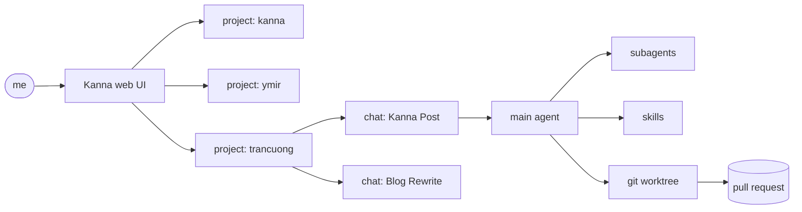
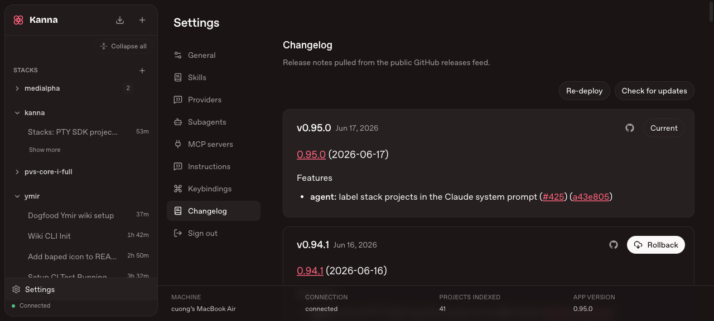
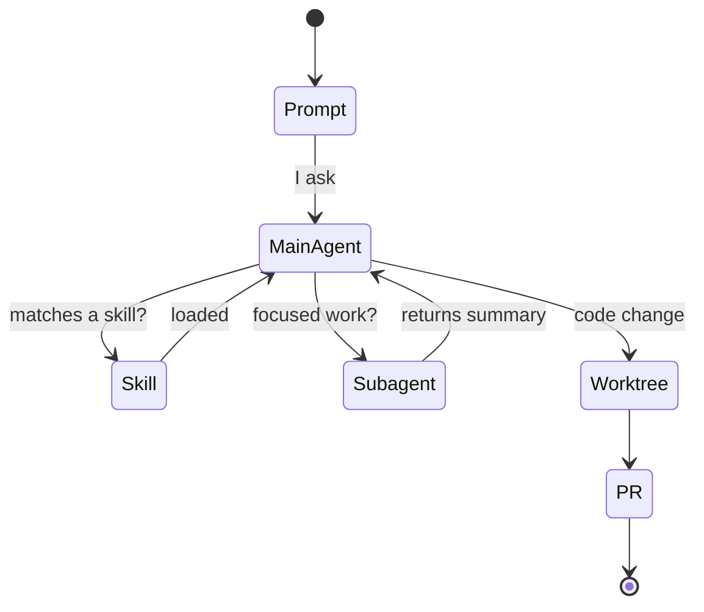

I used to keep one terminal tab open per project, each running a coding agent,
each with its own scrollback I had to remember. Switching context meant hunting
for the right window and re-reading where the agent left off. It did not scale
past three projects.

Kanna replaced all of that with one browser tab. Every project is a row in the
sidebar; every conversation is a chat under it; the agent keeps running whether
or not I'm looking. This is the shape of it:

### One sidebar, every project

The left rail lists every repo I'm working in — `kanna`, `ymir`,
`pvs-core-i-full`, `trancuong`, and a dozen more. Each holds its own chats with
live timers, so a glance tells me which agents are still running and which
finished hours ago. No window hunting.

The status bar at the bottom is the part I didn't know I wanted: machine,
connection state, and **41 projects indexed**. The agent isn't guessing at my
layout — it has the whole workspace mapped.

### Settings is where the behavior lives

Most agent tools bury their config. Kanna puts it one click away: Skills,
Subagents, MCP servers, and Instructions each get a panel.

Subagents are the lever I lean on hardest. When a task is self-contained —
"locate every caller of this function", "review this diff" — I hand it to a
specialized subagent that runs in its own session and reports back a summary.
My main chat stays readable instead of drowning in tool output.

### The rules that make it safe

Two project rules turn this from "fun" into "trustworthy". Every change starts
with a `git pull` on main and runs inside a **git worktree**, never the live
branch — the same discipline I wrote about in
[wtguard](/posts/wtguard-parallel-agents/). When the work is done, the agent
opens a PR; it never merges to main on its own.

That's the whole reason I can let several agents run at once without watching
each one. The blast radius of any single chat is a branch and a pull request,
nothing more.

The terminal-tab era is over for me. One tab, every project, agents that keep
working while I read something else.
