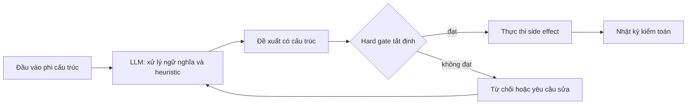
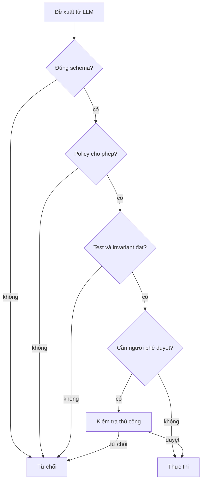

Tôi không cố biến LLM thành hệ thống tất định. Tôi dùng tính bất định của nó ở nơi sự mơ hồ chính là bài toán: hiểu ý định, so sánh ngữ nghĩa, tìm kế hoạch hợp lý, hoặc dùng heuristic khi không thể viết đủ quy tắc.

Sau đó tôi ngừng tin nó. Trước khi kết quả được phép thay đổi trạng thái hệ thống, một cổng tất định sẽ xác minh mọi thứ có thể xác minh. LLM đưa ra đề xuất; hệ thống quyết định đề xuất đó có được đi tiếp hay không.

### Bất định là lợi thế, không phải lỗi

Yêu cầu như “tìm phần rủi ro trong migration này” không có duy nhất một đáp án máy móc. Mô hình có thể tổng hợp ngữ cảnh, suy ra ý định và phát hiện điều tôi chưa mã hóa thành quy tắc. Đó là lý do tôi dùng nó.

Nhưng LLM không phù hợp làm thẩm quyền cuối cùng. Temperature bằng không vẫn không biến nó thành rules engine ổn định. Model update, hạ tầng, thứ tự context và đầu vào mơ hồ vẫn có thể đổi kết quả.

Vì vậy tôi tách hai công việc: **phán đoán ngữ nghĩa** thuộc về mô hình; **bất biến của hệ thống** thuộc về code.

### Guardrail hướng dẫn; hard gate quyết định

Prompt, ví dụ, schema và mô tả tool là guardrail. Chúng làm kết quả tốt dễ xuất hiện và dễ kiểm tra hơn, nhưng không chứng minh kết quả an toàn.

Hard gate chạy ngoài mô hình và chỉ trả về: cho qua, từ chối, hoặc chuyển cho người. Nó phải đủ nhỏ để hiểu và đủ chặt để không lời giải thích nào vượt qua.

Đề xuất nên là dữ liệu có cấu trúc, không phải văn xuôi cần đoán cách diễn giải. Cổng kiểm tra xác minh kiểu dữ liệu, thao tác, giới hạn, quyền, test và trạng thái. Không thể xác minh thì phải dừng hoặc chuyển cấp.

### Những nơi tôi áp dụng cách này

Với coding agent, LLM chọn cách triển khai và viết patch. Type check, test, linter, dependency policy và protected branch quyết định code có được merge hay không.

Với support automation, LLM phân loại ý định và soạn câu trả lời. Quyền tài khoản, hạn mức hoàn tiền, nội dung bắt buộc và quyền gửi vẫn là kiểm tra tất định.

Với data extraction, LLM chuyển tài liệu lộn xộn thành schema. Parser kiểm tra cấu trúc, business rule kiểm tra quan hệ, còn trường hợp thiếu chắc chắn hoặc giá trị cao được chuyển cho người.

Với hạ tầng, LLM đề xuất kế hoạch; allowlist, policy engine, giới hạn diff và phê duyệt bảo vệ bước thực thi. Mô hình không nên vừa nghĩ ra hành động vừa tự tuyên bố nó an toàn.

### Thiết kế cổng trước khi viết prompt

Tôi bắt đầu bằng invariant: điều luôn phải đúng, điều không được xảy ra và việc cần người duyệt. Từ đó tôi có output contract và phép kiểm tra. Sau cùng tôi mới thiết kế prompt.

Cách này làm retry an toàn. Hệ thống trả lý do machine-readable để mô hình sửa, nhưng cổng không tự nới lỏng. Tôi lưu đầu vào, đề xuất, kết quả kiểm tra và side effect trong cùng audit trail.

Ranh giới rất đơn giản: dùng xác suất để khám phá ý nghĩa; dùng code tất định để bảo vệ thực tại.

_English version: [Nondeterministic LLMs need deterministic gates](/posts/nondeterministic-llms-deterministic-gates/)._
