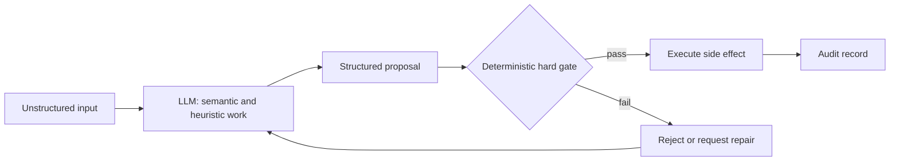
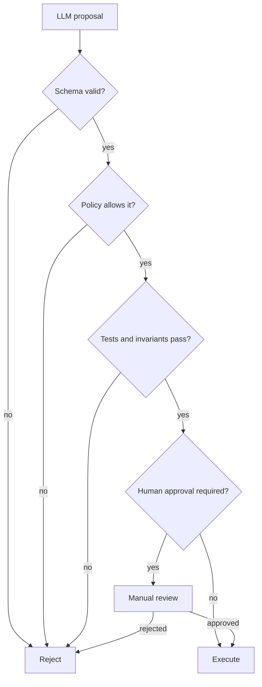

I do not try to make an LLM deterministic. I use its nondeterminism where ambiguity is the work: understanding intent, comparing meanings, finding a plausible plan, or applying a heuristic when no complete rule exists.

Then I stop trusting it. Before the result can change state, a deterministic gate verifies what can be verified. The LLM proposes; the system decides whether that proposal is allowed to proceed.

### Nondeterminism is useful, not defective

A request such as “find the risky part of this migration” does not have one mechanically correct answer. The model can combine context, infer intent, rank alternatives, and surface something I did not encode in advance. That is exactly why I use it.

The same property makes it a poor authority. Sampling settings can reduce variation, but even temperature zero does not turn an LLM into a stable rules engine. Model updates, infrastructure, context ordering, and ambiguous inputs can still change the output.

So I separate two jobs: **semantic judgment** belongs to the model; **system invariants** belong to code.

### Guardrails guide; hard gates decide

Prompts, examples, schemas, and tool descriptions are guardrails. They make good output more likely and easier to inspect. They do not prove that an output is safe.

A hard gate runs outside the model and returns a bounded result: pass, fail, or escalate. It should be small enough to understand and strict enough that no persuasive sentence can bypass it.

The proposal should be structured data, not prose that another component must guess how to interpret. The gate can then check types, allowed operations, resource limits, permissions, tests, and current state. If verification is impossible, that fact is itself a reason to stop or escalate.

### Where I use this pattern

For coding agents, the LLM can choose an implementation and write a patch. Type checks, tests, linters, dependency policies, and protected branches decide whether it can merge.

For support automation, the LLM can classify intent and draft a reply. Account ownership, refund limits, required disclosures, and send permission remain deterministic checks.

For data extraction, the LLM can map messy documents into a schema. Parsers validate the shape, business rules validate relationships, and uncertain or high-value cases go to a person.

For infrastructure, the LLM can propose a plan, but an allowlist, policy engine, diff limits, and explicit approval guard execution. A model should never be the component that both invents an action and declares it safe.

### Design the gate before the prompt

I start by writing the invariants: what must always be true, what must never happen, and what requires a human. That defines the output contract and the checks. Only then do I design the prompt that helps the model produce a valid proposal.

This makes retries safe. A failed proposal can return machine-readable reasons to the model for repair, but the gate does not weaken itself to make the retry pass. I also keep the original input, proposal, gate result, and side effect in one audit trail.

The boundary is simple: use probability to explore meaning; use deterministic code to protect reality.

_Vietnamese version: [LLM bất định cần cổng kiểm tra tất định](/posts/llm-bat-dinh-cong-kiem-tra-tat-dinh/)._
