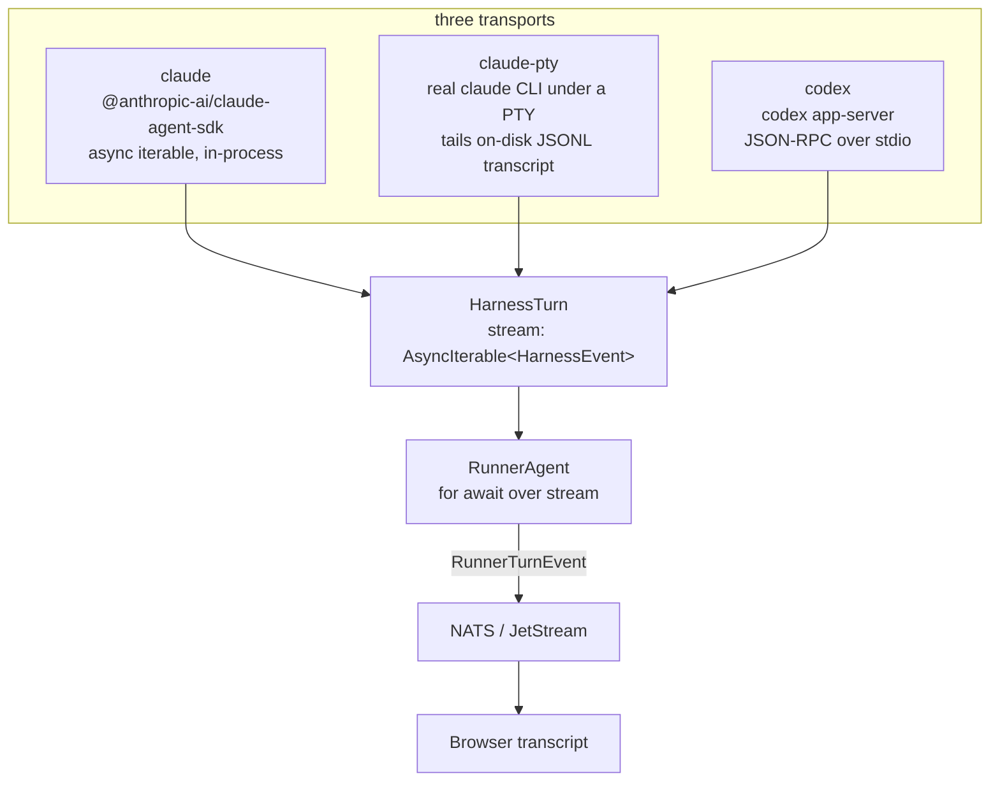
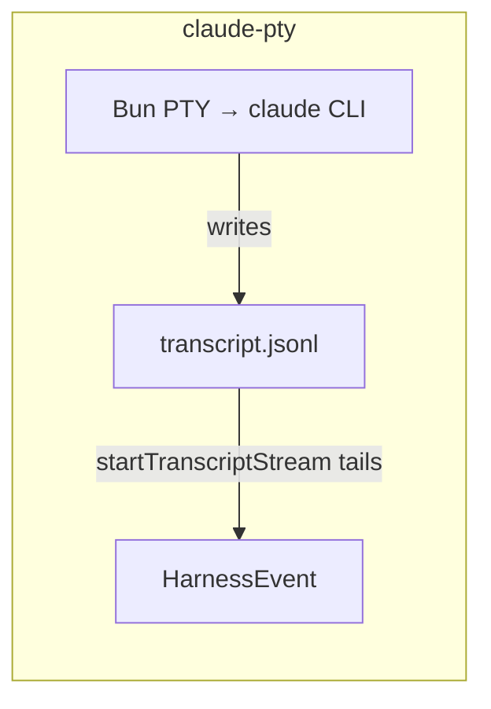

Kanna is a local-first workbench that runs Claude Code and Codex side by side in one browser UI. The problem is that those two agents — plus the two ways I drive Claude — don't agree on anything at the wire level. One is an in-process async iterable. One is a real terminal whose output I have to read off a file on disk. One is JSON-RPC over a child process's stdout.

The rest of the system can't care about that. The runner that streams a turn, the projection that renders the transcript, the NATS publisher — none of them should know whether the bytes came from an SDK call or a pseudo-terminal. So everything funnels through one interface, and the interface is tiny.



### The whole contract

This is `src/shared/harness-types.ts` — the entire abstraction the three transports have to satisfy:

```typescript
export interface HarnessTurn {
  provider: AgentProvider;
  stream: AsyncIterable<HarnessEvent>;
  getAccountInfo?: () => Promise<AccountInfo | null>;
  getContextUsage?: () => Promise<{
    percentage: number;
    totalTokens: number;
    maxTokens: number;
  } | null>;
  interrupt: () => Promise<void>;
  close: () => void;
}
```

A turn is a thing you can iterate, interrupt, and close. That's it. The runner does `for await (const event of turn.stream)` and re-publishes each `HarnessEvent` to NATS. It never branches on the provider.

### Three implementations that share nothing

The Claude SDK path is the easy one — the SDK already hands back an async query, so the turn is almost a pass-through:

```typescript
const q = sdk.startup
  ? (await sdk.startup({ options })).query(args.content)
  : sdk.query({ prompt: args.content, options });

return {
  provider: "claude",
  stream: createClaudeHarnessStream(q),
  interrupt: async () => {
    await q.interrupt();
  },
  close: () => {
    q.close();
  },
};
```

Codex shares none of that machinery. `codex app-server` speaks JSON-RPC: I send `turn/start`, then `item/started` notifications arrive on the child's stdout, one JSON object per line. There's no async iterable to hand back, so I build one — an `AsyncQueue<HarnessEvent>` that a `readline` loop feeds as lines come in, exposed as the same `stream`.

The third path is the strangest. `claude-pty` spawns the real `claude` CLI under a Bun native PTY — needed for OAuth-pool multi-token support and full TUI parity. But you can't parse a terminal's escape-soup as a structured event stream. So the driver ignores stdout for data and instead **tails the JSONL transcript Claude writes to disk**, turning new lines into `HarnessEvent`s. The PTY exists to run the process; the file is the actual data channel.



Three transports — an in-process iterable, a JSON-RPC queue, and a file tail behind a terminal — and the only thing they have in common is six fields. Spawning that PTY cleanly is its own subprocess problem, close to what I hit [composing os/exec pipelines in Go](/posts/subprocess-go-library/).

The payoff isn't the interface itself. It's that adding a fourth agent later is a contained problem: implement `HarnessTurn`, and the runner, the event store, and the UI never learn a new name.
