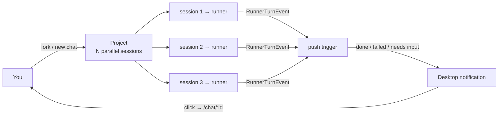

A single coding agent in a terminal holds your whole attention. You watch the output scroll, wait for it to finish, then start the next thing. One agent, one window, one task at a time. That's not where the value is — the value is shipping, and most of an agent's run is time you should be spending elsewhere.

Kanna is a local-first workbench that flips this. Each project holds many chat sessions at once, every session runs its own agent independently, and the moment one needs you — a plan to approve, a turn finished, a failure — it pushes a desktop notification. You fire work off, walk away, and come back when pinged.



### Many windows, one project

The sidebar groups chats by project, and several sessions for the same repo sit there side by side. The main pane is a resizable split — chat on one side, a file/diff panel on the other. You don't lose the parallel sessions when you focus one; they keep running.

Two operations make this cheap: **fork** spins a new session off a summary of the current one, and **merge** folds several back into one (`useAppState.ts`):

```ts
handleForkSession: (intent, provider, model, preset?) => Promise<void>;
handleMergeSession: (
  chatIds: string[],
  intent,
  provider,
  model,
  preset?,
  closeSources?
) => Promise<void>;
```

### Parallel by default

Within a single chat, turns queue. Across chats, there's no lock — every session runs at once (`runner-proxy.ts`):

```ts
async queue(command: ChatQueueCommand) {
  if (!this.hasActiveOrJustStartedTurn(command.chatId)) {
    await this.send({ ...command, type: "chat.send" })
    return { chatId: command.chatId, queued: false }
  }
  await this.store.enqueueQueuedTurn({ chatId: command.chatId, ... })
  return { chatId: command.chatId, queued: true }
}
```

Each session is its own runner with its own transport — same trick I described in [one streaming interface over three agent transports](/posts/one-interface-three-agent-transports/).

### Getting pinged, not babysitting

This only works if you can leave. Kanna watches every session's status and pushes a notification when it crosses a boundary (`server.ts`):

```ts
for (const [chatId, status] of currentActive) {
  const prev = previousStatuses.get(chatId);
  if (status === "waiting_for_user" && prev !== "waiting_for_user") {
    void sendPushToAll(pushStore, {
      title: "Input needed",
      body: chat?.title || chatId,
      url: `/chat/${chatId}`,
      tag: `waiting-${chatId}`,
    });
  }
}
```

Three signals fire: **Input needed** (a plan to approve), **Agent finished**, **Agent failed**. A service worker shows them as real desktop notifications, and clicking one focuses the tab straight at `/chat/<id>`.

### Approve the plan, don't read the diff

The reason you can ignore the running output is that you're not reviewing code — you're reviewing outcomes. When an agent calls `exit_plan_mode`, the server gates the tool and suspends until you click Approve. Tool calls fold into one collapsible card, diffs render as artifacts. You read a plan and a result, not a scrollback.

That's the whole shift: from watching one agent type, to dispatching many and judging what comes back.
