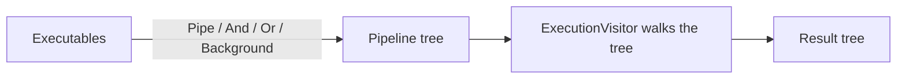
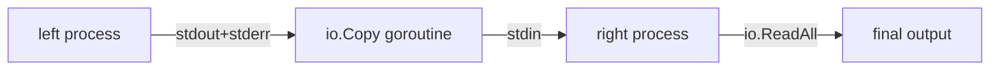

In small Go tools I kept rewriting the same `os/exec` plumbing: start a command, wire the pipes, feed stdin, drain stdout and stderr, decide how to shut it down. I wanted to compose commands the way a shell does — `echo | grep && notify || fallback` — but from Go, with real error handling and a cancelable context.

That is `subprocess`. You build `Executable` values and join them with operators. Each operator returns another `Executable`, so a pipeline is a tree, and a visitor walks it.



### The leaf: a process you can talk to

The bottom layer is a thin wrapper over `os/exec`. `ReaderWriter()` hands back one `io.ReadWriteCloser` — writing goes to stdin, reading pulls stdout and stderr combined, closing signals EOF.

```go
process, _ := subprocess.NewProcess("cat", []string{})

runner, _ := process.Exec(context.Background())
rw := runner.ReaderWriter()

fmt.Fprintln(rw, "Hello, subprocess!")
rw.Close() // close stdin to signal EOF

output, _ := io.ReadAll(rw) // stdout + stderr, combined
runner.Wait()
```

Folding the three pipes into one `ReadWriteCloser` is the one opinion this layer holds. It makes the common case — talk to a process, read what it says — boring, which is what I want from the leaf.

### Composing with operators

The `Executable` interface is the interesting layer. Every method returns another `Executable`, so operators chain. Comments map each to its shell equivalent.

```go
type Executable interface {
	Run(ctx context.Context) (*Result, error)
	Pipe(next Executable) Executable // this | next
	And(next Executable) Executable  // this && next
	Or(next Executable) Executable   // this || next
	Background() Executable          // this &
	WithShutdownTimeout(timeout time.Duration) Executable
}
```

Because the return type is always `Executable`, a shell line reads almost the same in Go:

```go
echo, _ := subprocess.NewExecutable("echo", "test")
grep, _ := subprocess.NewExecutable("grep", "test")
found, _ := subprocess.NewExecutable("echo", "found")
missing, _ := subprocess.NewExecutable("echo", "not found")

// (echo test | grep test) && echo found || echo "not found"
result, _ := echo.Pipe(grep).And(found).Or(missing).Run(ctx)
fmt.Println(string(result.Stdout)) // found
```

Each call builds a `Pipeline` node holding an operation, a left side, and a right side. Nothing runs until `Run`.

### The visitor that runs the tree

`Run` builds an `ExecutionVisitor` and dispatches on operation type — `VisitPipe`, `VisitAnd`, `VisitOr`, `VisitBackground`. Splitting "what the pipeline is" from "how it runs" keeps each operator's semantics in one small method, not one giant switch.

The pipe is the part worth showing. It connects left's output to right's input with an `io.Copy` in its own goroutine, so both processes stream concurrently instead of buffering in memory.



```go
// connect left's output to right's input; copy in a goroutine
// so both processes run concurrently
go func() {
	io.Copy(rightRunner.ReaderWriter(), leftRunner.ReaderWriter())
	rightRunner.ReaderWriter().Close() // close stdin to signal EOF
}()

output, _ := io.ReadAll(rightRunner.ReaderWriter())
leftErr := leftRunner.Wait()
rightErr := rightRunner.Wait()
```

`And` and `Or` are sequential and short-circuit on exit code, matching bash: `&&` skips the right side on failure, `||` recovers from it. `Background` starts a job and returns immediately, and `Run` waits for every background job before it returns.

### The result is a tree, not a string

The visitor does not collapse everything into one buffer. It returns a `Result` whose `Children` mirror the pipeline, so I can inspect any stage after the fact.

```go
type Result struct {
	Type     OperationType // single, pipe, and, or, background
	Stdout   []byte
	Stderr   []byte
	ExitCode int
	Error    error
	Skipped  bool      // true for the skipped side of && / ||
	Children []*Result // child results, mirroring the tree
}
```

That tree is what separates this from gluing `exec.Cmd` calls by hand: shell-like composition plus a structured trace of what actually ran — the same bias toward a narrow, honest surface I wrote about in [my go-scaffolding post](/posts/go-clean-architecture).
