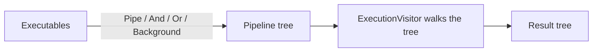
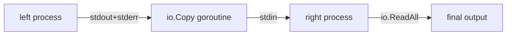

I kept rewriting the same `os/exec` plumbing in small Go tools: start a command, wire up the pipes, feed stdin, drain stdout and stderr, decide how to shut it down. What I actually wanted was to compose commands the way a shell does — `echo | grep && notify || fallback` — but from Go, with real error handling and a context I can cancel.

That is what `subprocess` turned into. You build `Executable` values and join them with operators. Each operator returns another `Executable`, so a whole pipeline is just a tree, and a visitor walks that tree to run it.



### The leaf: a process you can talk to

The bottom layer is still a thin wrapper over `os/exec`. `NewProcess` builds it, `Exec` starts it, and `ReaderWriter()` hands back one `io.ReadWriteCloser` — writing goes to stdin, reading pulls stdout and stderr combined, closing signals EOF.

```go
process, _ := subprocess.NewProcess("cat", []string{})

runner, _ := process.Exec(context.Background())
rw := runner.ReaderWriter()

fmt.Fprintln(rw, "Hello, subprocess!")
rw.Close() // close stdin to signal EOF

output, _ := io.ReadAll(rw) // stdout + stderr, combined
runner.Wait()
```

Folding the three pipes into a single `ReadWriteCloser` is the one opinion this layer holds. It makes the common case — talk to a process, read what it says — boring, which is exactly what I want from the leaf.

### Composing with operators

The interesting layer is the `Executable` interface. Every method returns another `Executable`, so the operators chain. The comments map each one to its shell equivalent.

```go
type Executable interface {
	Run(ctx context.Context) (*Result, error)
	Pipe(next Executable) Executable // this | next
	And(next Executable) Executable  // this && next
	Or(next Executable) Executable   // this || next
	Background() Executable          // this &
	WithShutdownTimeout(timeout time.Duration) Executable
}
```

Because the return type is always `Executable`, a real shell line reads almost the same in Go:

```go
echo, _ := subprocess.NewExecutable("echo", "test")
grep, _ := subprocess.NewExecutable("grep", "test")
found, _ := subprocess.NewExecutable("echo", "found")
missing, _ := subprocess.NewExecutable("echo", "not found")

// (echo test | grep test) && echo found || echo "not found"
result, _ := echo.Pipe(grep).And(found).Or(missing).Run(ctx)
fmt.Println(string(result.Stdout)) // found
```

Each call builds a `Pipeline` node holding an operation, a left side, and a right side. Nothing runs until `Run`.

### The visitor that runs the tree

`Run` constructs an `ExecutionVisitor` and dispatches on the operation type — `VisitPipe`, `VisitAnd`, `VisitOr`, `VisitBackground`. Splitting "what the pipeline is" from "how it executes" keeps each operator's semantics in one small method instead of one giant switch.

A pipe is the part worth showing. It connects the left process's output to the right's input with an `io.Copy` running in its own goroutine, so both processes stream concurrently instead of buffering everything in memory.



```go
// connect left's output to right's input; copy in a goroutine
// so both processes run concurrently
go func() {
	io.Copy(rightRunner.ReaderWriter(), leftRunner.ReaderWriter())
	rightRunner.ReaderWriter().Close() // close stdin to signal EOF
}()

output, _ := io.ReadAll(rightRunner.ReaderWriter())
leftErr := leftRunner.Wait()
rightErr := rightRunner.Wait()
```

`And` and `Or` are sequential and short-circuit on exit code, matching bash: `&&` skips the right side on failure, `||` recovers from it. `Background` starts a job and returns immediately, and `Run` waits for every background job before it returns.

### The result is a tree, not a string

The visitor does not collapse everything into one buffer. It returns a `Result` whose `Children` mirror the pipeline structure, so I can inspect any stage after the fact.

```go
type Result struct {
	Type     OperationType // single, pipe, and, or, background
	Stdout   []byte
	Stderr   []byte
	ExitCode int
	Error    error
	Skipped  bool      // true for the skipped side of && / ||
	Children []*Result // child results, mirroring the tree
}
```

That tree is what separates this from gluing `exec.Cmd` calls together by hand. I get shell-like composition and a structured trace of what actually ran — which is the same bias toward a narrow, honest surface I wrote about in [my go-scaffolding post](/posts/go-clean-architecture).
