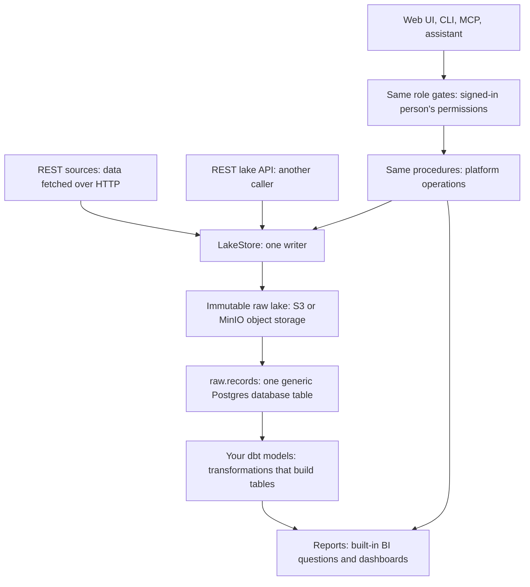
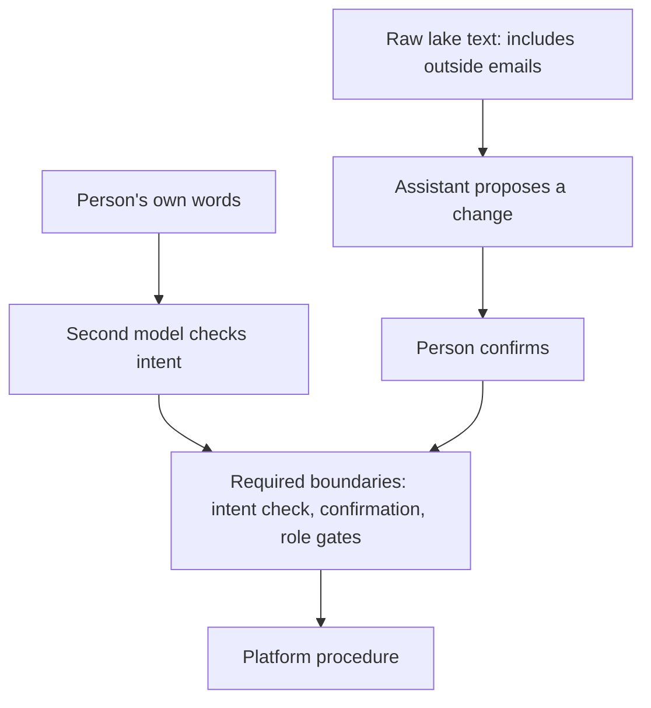

Most pipelines transform data on the way in. When the transformation or schema—the expected data structure—is wrong, the original is already gone, and a wrong dashboard number looks exactly like a right one. Undercroft flips that: an **immutable raw lake** keeps the original bytes without overwriting them, and everything above it can be dropped and rebuilt.

An undercroft is the vaulted chamber beneath a building, holding up what stands above it and outliving it. That's the foundation I want for this data platform.



### Raw is the only durable layer

Raw cannot be recomputed, so it's the layer I keep. Everything in Postgres can be rebuilt, starting with `raw.records`, which holds every record in one generic table. Undercroft ships no business schema; it has no opinion about what a “customer” is.

For the tables you actually query, you write models in dbt: a tool where you write SQL SELECT statements and it builds tables from them. Your dbt models turn `raw.records` into those tables.

The lake is **create-only**: an existing observation cannot be overwritten. It's also **content-addressed**: each observation is stored under its SHA-256 hash, a fingerprint of its bytes. Storing identical bytes again writes nothing, as `packages/lake/src/store.ts` shows:

<!-- prettier-ignore -->
```ts
    const digest = await sha256Hex(data);
    const blob = LakeStore.blobKey(digest);

    const previous = await this.newestSha(key);
    if (previous === digest) {
      return {
        status: "unchanged",
        sha256: digest,
        previousSha256: previous,
        blobKey: blob,
        versionKey: "",
        bytes: data.byteLength,
        pruned: [],
      };
    }

    // The blob is shared, so an existing one with a matching digest is not a collision --
    // it is deduplication working. Only write if absent.
    if (!(await this.#store.exists(blob))) {
      await this.#store.put(blob, data);
    }
```

Every byte enters through `LakeStore`. The REST lake API calls that same path, so a shell script can land data too.

### A connector is YAML, not code

A connector describes how to fetch data from a source. I keep that description in YAML configuration: address, authentication, pagination for fetching successive pages, what to collect, and cursors for tracking progress. A JSON schema at `specs/schema/connector.v1.json` checks that the configuration has the right structure.

```yaml
apiVersion: undercroft.dev/v1
kind: Connector
id: hubspot
displayName: HubSpot CRM
baseUrl: https://api.hubapi.com

auth:
  kind: bearer
  token: { from: connection }

defaults:
  pagination:
    kind: json-link
    nextPath: paging.next.link
  rateLimit:
    requestsPerMinute: 100 # 110/10s burst on a Pro portal; leave headroom

entities:
  - name: contacts
    request:
      kind: list
      path: /crm/v3/objects/contacts
    envelopePath: results
    idPath: id
    updatedAtPath: updatedAt
    incremental:
      strategy: client-filter
      # NOT hs_lastmodifieddate. HubSpot names it differently on contacts, and the
      # wrong name yields a cursor that never advances.
      sourcePath: properties.lastmodifieddate
```

HubSpot and Xero ship as examples. Adding a REST source needs no migration—no change to the database structure. Gmail and Google Drive have dedicated document collectors; extracted text lands beside the records.

### Never guess

I'd rather see an empty cell than a convincing wrong value. Undercroft returns nothing and says why; a refused row is recorded with its reason. “No evidence” never means “pass”, as `packages/core/src/money.ts` shows:

<!-- prettier-ignore -->
```ts
export function compare(
  observed: Money | null,
  expected: Money | null,
  tolerance = "0.02",
): Verdict {
  if (observed === null || expected === null) {
    return "unverified";
  }
  if (observed.currency !== expected.currency) {
    return "unverified";
  }
  return toBig(observed).minus(toBig(expected)).abs().lte(new Big(tolerance)) ? "ok" : "mismatch";
}
```

Money stays a string end to end, with big.js handling decimal arithmetic. JavaScript's float `number` cannot represent many decimal amounts exactly, so `0.1 + 0.2` is not `0.3`; a string keeps the exact digits. An unreadable amount becomes `null`, meaning missing, never `0`.

### Every door is the same door

Each procedure is an operation the platform's API offers, like triggering a sync or saving a model. The web UI, the CLI (the command-line tool), and MCP—the protocol that exposes these operations as tools to AI clients—reach the same procedures. Whichever door you use, you get exactly your own permissions—never more.

A tenant is a group with its own data on the shared platform; Postgres row-level security keeps its rows separate. Reports, the built-in business intelligence (BI) interface, runs questions and dashboards using that tenant's read-only database login.

The in-app assistant proposes changes for you to confirm. A separate model checks your own words, excluding tool results, to see whether you asked for the change; an unconfigured gate denies. This fits how I think about [LLMs proposing and deterministic code deciding](/posts/nondeterministic-llms-deterministic-gates/): the model judges intent, and procedures enforce permissions.



That's a boundary against **prompt injection**: instructions hidden inside content the assistant reads, like an email, trying to make it act. Signing in and allowing writes stay a person's job.

Undercroft is pre-alpha, under active construction, with nothing stable yet. It is MIT-licensed and self-hostable: [the repository is here](https://github.com/muitneliss/undercroft).
