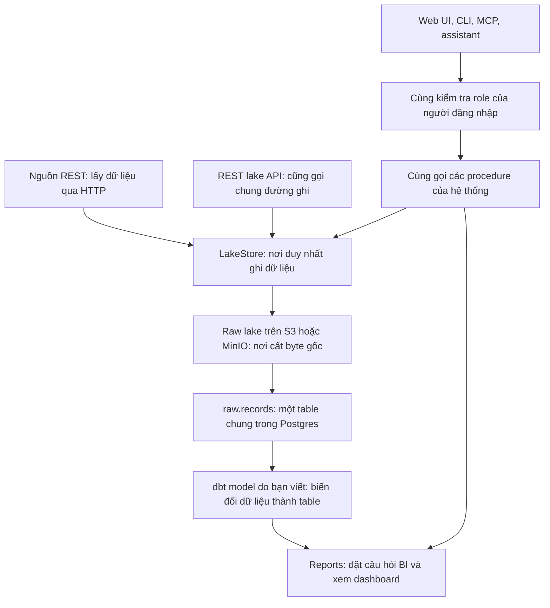
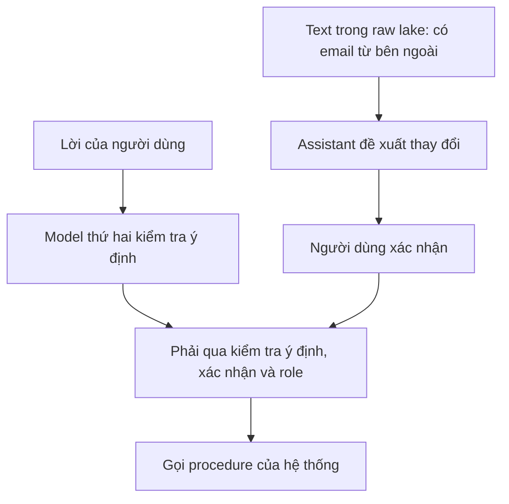

Phần lớn pipeline biến đổi dữ liệu ngay khi lấy về. Đến lúc phát hiện xử lý sai hoặc schema — cấu trúc dữ liệu dự kiến — sai, bản gốc đã mất; số sai trên dashboard vẫn trông như số đúng. Undercroft làm ngược lại: **immutable raw lake** giữ bản gốc đúng từng byte, không ghi đè; mọi thứ bên trên đều có thể bỏ đi rồi dựng lại.

Undercroft là gian hầm có mái vòm dưới một tòa nhà, nâng đỡ và tồn tại lâu hơn phần bên trên. Tôi muốn nền tảng dữ liệu này cũng vậy.



### Chỉ raw lake là layer cần giữ mãi

Mất bản gốc thì không có cách nào dựng lại raw, nên tôi giữ nó làm nền. Còn mọi thứ trong Postgres đều bỏ đi rồi dựng lại được từ raw, bắt đầu từ `raw.records`: nó chứa mọi record trong một table chung. Undercroft không định nghĩa sẵn “customer” là gì.

dbt là tool cho bạn viết câu SQL SELECT rồi dựng table từ đó. Bạn viết dbt model để biến dữ liệu trong `raw.records` thành các table thực sự cần query.

Raw lake là **create-only**: đã ghi thì không ghi đè. Nó cũng **content-addressed**: dùng hash SHA-256, dấu vân tay tính từ byte, làm địa chỉ lưu, nên ghi lại byte giống hệt không ghi thêm gì. Đây là đoạn ghi trong `packages/lake/src/store.ts`:

<!-- prettier-ignore -->
```ts
    const digest = await sha256Hex(data);
    const blob = LakeStore.blobKey(digest);

    const previous = await this.newestSha(key);
    if (previous === digest) {
      return {
        status: "unchanged",
        sha256: digest,
        previousSha256: previous,
        blobKey: blob,
        versionKey: "",
        bytes: data.byteLength,
        pruned: [],
      };
    }

    // The blob is shared, so an existing one with a matching digest is not a collision --
    // it is deduplication working. Only write if absent.
    if (!(await this.#store.exists(blob))) {
      await this.#store.put(blob, data);
    }
```

Mọi byte đều đi qua `LakeStore`. REST lake API cũng chỉ là một bên gọi vào đường này, nên một shell script bên ngoài cũng đưa dữ liệu vào được mà không thành nơi ghi thứ hai.

### Connector là YAML

Connector mô tả cách lấy dữ liệu từ một nguồn, được viết bằng YAML. Spec khai báo địa chỉ, auth, cách lấy từng trang và cursor theo dõi tiến độ. JSON schema kiểm tra cấu trúc của spec.

```yaml
apiVersion: undercroft.dev/v1
kind: Connector
id: hubspot
displayName: HubSpot CRM
baseUrl: https://api.hubapi.com

auth:
  kind: bearer
  token: { from: connection }

defaults:
  pagination:
    kind: json-link
    nextPath: paging.next.link
  rateLimit:
    requestsPerMinute: 100 # 110/10s burst on a Pro portal; leave headroom

entities:
  - name: contacts
    request:
      kind: list
      path: /crm/v3/objects/contacts
    envelopePath: results
    idPath: id
    updatedAtPath: updatedAt
    incremental:
      strategy: client-filter
      # NOT hs_lastmodifieddate. HubSpot names it differently on contacts, and the
      # wrong name yields a cursor that never advances.
      sourcePath: properties.lastmodifieddate
```

HubSpot và Xero có sẵn làm ví dụ. Thêm nguồn REST không cần migration, tức không phải đổi cấu trúc database. Gmail và Google Drive có collector riêng để lấy email và file; text lấy ra được lưu cạnh record.

### Không đoán cho đủ ô

Tôi thà thấy ô trống còn hơn số sai trông hợp lý. Undercroft trả về thiếu dữ liệu và nói rõ lý do; row bị từ chối cũng được ghi lại kèm lý do. Hàm `compare` trong `packages/core/src/money.ts` không coi thiếu bằng chứng là đạt:

<!-- prettier-ignore -->
```ts
export function compare(
  observed: Money | null,
  expected: Money | null,
  tolerance = "0.02",
): Verdict {
  if (observed === null || expected === null) {
    return "unverified";
  }
  if (observed.currency !== expected.currency) {
    return "unverified";
  }
  return toBig(observed).minus(toBig(expected)).abs().lte(new Big(tolerance)) ? "ok" : "mismatch";
}
```

Tiền luôn là string từ đầu đến cuối, dùng big.js để tính. Float của JavaScript không biểu diễn chính xác nhiều số thập phân, nên `0.1 + 0.2` không bằng `0.3`; string giữ nguyên từng chữ số. Số tiền không đọc được là `null`, không phải `0`.

### Vào cửa nào cũng kiểm tra quyền như nhau

Procedure là từng thao tác API cung cấp, như chạy sync hay lưu model. Web UI, CLI chạy từ terminal, và MCP — giao thức cho AI client gọi các thao tác như tool — dùng chung procedure. Vào cửa nào cũng chỉ có quyền của người đăng nhập.

Tenant là nhóm dùng chung hệ thống nhưng có dữ liệu riêng; Postgres row-level security giữ các row tách biệt giữa các tenant. Reports chạy câu hỏi và dashboard bằng database login chỉ đọc của tenant.

Assistant trong app đề xuất thay đổi để bạn xác nhận. Một model riêng đọc lời bạn, bỏ qua kết quả trả về từ tool, để kiểm tra bạn có yêu cầu thay đổi đó không; gate chưa cấu hình thì từ chối. Như tôi viết trong [LLM đề xuất, code quyết định](/posts/llm-bat-dinh-cong-kiem-tra-tat-dinh/), procedure vẫn kiểm tra quyền.



Đây là để chặn **prompt injection**: chỉ dẫn giấu trong nội dung assistant đọc, như email, nhằm khiến nó làm theo. Đăng nhập và cho phép ghi vẫn do người dùng quyết định.

Undercroft đang pre-alpha, chưa có gì ổn định. Dự án dùng MIT, có thể self-host: [repo Undercroft](https://github.com/muitneliss/undercroft).
