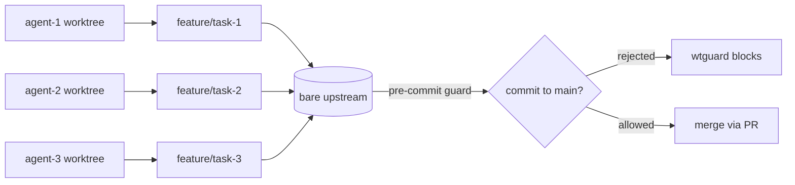
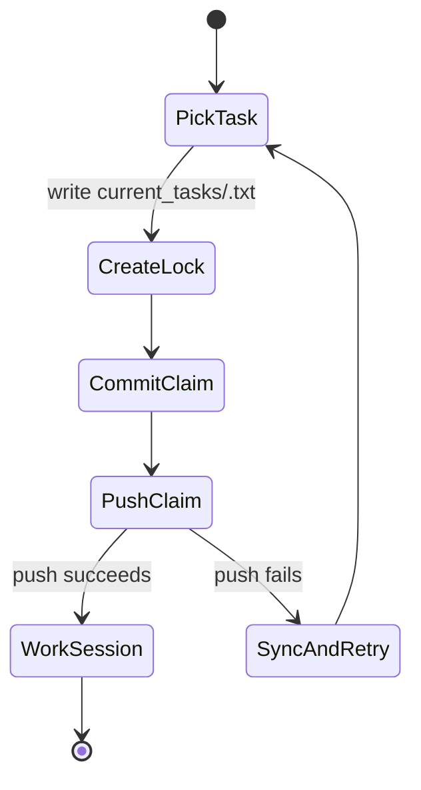

The first time I tried running multiple Claude Code sessions against the same repository, the failure mode was obvious: they all had the same working tree, the same index, and the same idea that `main` was a reasonable place to put work.

That does not scale. Two agents editing the same checkout is not collaboration. It is a race condition with a chat interface.

> **Key Takeaways**
> - Each agent gets its own Docker container with a private `/workspace` clone of a shared bare upstream, so file system state never collides between agents.
> - Agents coordinate through Git and lock files, not through each other. A failed push means another agent claimed the task first.
> - `wtguard` installs a pre-commit hook on `main` so even a human working in the same repo cannot accidentally commit there directly.

## The two-part fix

My fix has two parts. `agent-teams-setup` gives each agent an isolated workspace and a shared upstream. `wtguard` is the seatbelt I want in every local flow: a tiny Go CLI that installs a pre-commit guard so direct commits to `main` are rejected before they become history.



## Isolated workspaces via Docker

The orchestration side is deliberately boring. `agent-teams-setup` creates a bare repo, seeds a task list, then runs agents in separate Docker containers. Each container clones the same upstream into its own `/workspace`, so the file system state is private even though the Git history is shared.

```bash
# scripts/agent-entrypoint.sh
git config --global user.name "$AGENT_ID"
git config --global user.email "${AGENT_ID}@agent-teams.local"
git config --global pull.rebase true
git config --global merge.conflictstyle diff3
git config --global rerere.enabled true

git clone /upstream /workspace
cd /workspace
```

That small separation matters. An agent can run formatters, create temporary files, and inspect its own dirty state without stepping on another agent's index.

The team composition comes from config, then `spawn-agents.sh` turns it into containers:

```bash
CLAUDE_MODEL="$(config_get "agents.model" "${CLAUDE_MODEL:-claude-sonnet-4-5-20250929}")"
SESSION_TIMEOUT="$(config_get "agents.session_timeout" "${SESSION_TIMEOUT:-3600}")"
UPSTREAM_DIR="$(config_get "project.upstream_dir" "${UPSTREAM_DIR:-/tmp/agent-upstream}")"

docker run -d \
    --name "$AGENT_NAME" \
    -e AGENT_ID="$AGENT_NAME" \
    -e AGENT_ROLE="$role" \
    -e CLAUDE_MODEL="$CLAUDE_MODEL" \
    -v "${UPSTREAM_DIR}:/upstream" \
    -v "${ROOT_DIR}/prompts/agent-prompt.md:/config/agent-prompt.md:ro" \
    "${IMAGE_NAME}:latest"
```

## Coordinating through Git, not each other

The agents do not coordinate by talking to each other. They coordinate through Git and files. The prompt tells them to claim work by creating a lock file under `current_tasks/`, commit it, and push. If the push fails, somebody else probably claimed the task first.



```bash
git add current_tasks/<task_name>.txt
git commit -m "[agent-{ID}] claim: <task_name>"
git push origin main
```

The loop also treats sync as a normal operation, not an exceptional one. Before each session it pulls. After a session, if there are changes, it commits and calls the sync helper.

```bash
git pull --rebase origin main 2>/dev/null || {
    git rebase --abort 2>/dev/null || true
    git reset --hard origin/main 2>/dev/null || true
    git pull origin main 2>/dev/null || true
}

if [ -n "$(git status --porcelain 2>/dev/null)" ]; then
    git add -A
    git commit -m "[$AGENT_ID] wip: auto-save from session #$SESSION_COUNT" 2>/dev/null || true
    /scripts/sync-upstream.sh 2>/dev/null || true
fi
```

## The pre-commit guard

This is where `wtguard` fits into my personal workflow. Docker agents can coordinate through the shared upstream, but my own terminal still needs a hard rule: never commit directly to `main`. The guard belongs at the Git boundary because that is the last reliable place before a mistake becomes shared state.

I like this pattern because it does not depend on perfect behavior from agents or humans. Agents get isolated workspaces. Tasks get lock files. Pushes go through a retry/rebase path. Humans get a pre-commit guard on `main`. None of those pieces is clever by itself, but together they turn parallel agent work from "hope nothing collides" into a workflow I can actually leave running.

---

## FAQ

**Why Docker containers instead of plain git worktrees?**

Git worktrees give you separate working trees but share the same host file system. Two agents could still clobber each other's build artifacts, temporary files, or tool caches. Docker gives each agent a private file system namespace so there is no overlap at all.

**What stops two agents from claiming the same task?**

Git push atomicity. Both agents write a lock file and commit it locally, but only the first push succeeds. The second agent gets a non-fast-forward rejection, pulls, sees the lock file already committed, and moves on to the next task.

**Why does `wtguard` block commits to main instead of using branch protection?**

Branch protection rules live on the remote (GitHub, GitLab). `wtguard` installs a local pre-commit hook that blocks the mistake before it even becomes a commit, so it works on local repos, bare upstreams, and any host. The two are complementary.

**How do agents handle merge conflicts?**

The entrypoint sets `rerere.enabled true`, so Git records resolved conflicts and reuses the resolution automatically. The rebase-on-pull path (`pull.rebase true`) keeps history linear and reduces conflict surface compared to merge commits.
