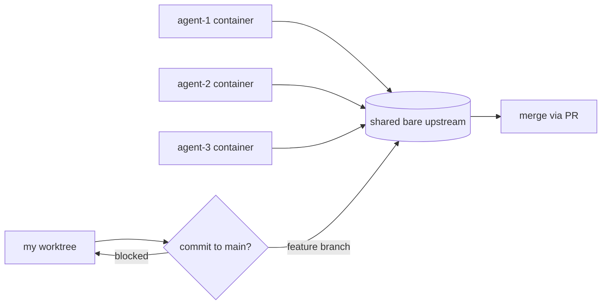
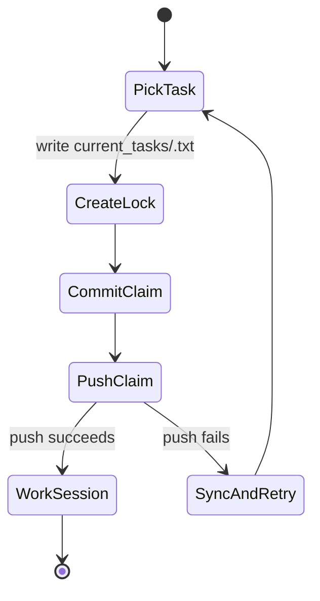

The first time I ran multiple Claude Code sessions against one repository, the failure was obvious: they shared a working tree, an index, and the same idea that `main` was a fine place to put work.

Two agents editing the same checkout is not collaboration. It is a race condition with a chat interface. My fix has two halves — an isolated workspace per agent, and a hard guard at the one boundary where mistakes become shared history.



### Isolated workspaces via Docker

`agent-teams-setup` runs each agent in its own Docker container. On startup it configures Git and clones the shared upstream into a private `/workspace` — file-system state isolated, history shared.

```bash
# scripts/agent-entrypoint.sh
git config --global user.name "$AGENT_ID"
git config --global user.email "${AGENT_ID}@agent-teams.local"
git config --global pull.rebase true
git config --global merge.conflictstyle diff3
git config --global rerere.enabled true

git clone /upstream /workspace
cd /workspace
```

`spawn-agents.sh` turns the team config into containers, mounting the same `/upstream` into each. That separation lets an agent run formatters, write temp files, and inspect its own dirty state without touching another's index.

### Coordinating through Git, not each other

Agents never talk to each other directly — they coordinate through Git. To claim work, an agent writes a lock file under `current_tasks/`, commits it, and pushes. If the push fails, someone else claimed it first. Push atomicity is the lock.



The loop treats sync as normal, not exceptional: pull before each session, fall back to a hard reset only when a rebase cannot apply cleanly.

```bash
git pull --rebase origin main 2>/dev/null || {
    git rebase --abort 2>/dev/null || true
    git reset --hard origin/main 2>/dev/null || true
    git pull origin main 2>/dev/null || true
}

if [ -n "$(git status --porcelain 2>/dev/null)" ]; then
    git add -A
    git commit -m "[$AGENT_ID] wip: auto-save from session #$SESSION_COUNT" 2>/dev/null || true
    /scripts/sync-upstream.sh 2>/dev/null || true
fi
```

### The guard at the git boundary

Docker agents coordinate through the upstream, but my own terminal still needs one rule: never commit directly to `main`. A plain pre-commit hook is not enough — anyone can pass `--no-verify`, delete the hook, or work in a fresh clone. So `wtguard` stacks three independent layers behind one install:

1. A `git` proxy placed first on `PATH`, which catches `--no-verify` and a missing hook.
2. The pre-commit hook itself, for when the proxy is bypassed (`/usr/bin/git` called directly).
3. Opt-in GitHub branch protection — server-side, and unbypassable.

Each layer alone is bypassable. All three together are not. What keeps them honest is that they all ask the same question, answered by one pure function with no Git calls of its own:

```go
// internal/guard/guard.go — the single source of truth,
// called by the proxy and the pre-commit hook
func Decide(r Rule) Decision {
	if r.BypassEnv {
		return Decision{Block: false, Reason: "bypass env set"}
	}
	if r.Detached {
		return Decision{Block: false, Reason: "detached HEAD"}
	}
	if !slices.Contains(r.ProtectedList, r.Branch) {
		return Decision{Block: false, Reason: "branch not protected"}
	}
	// default policy "always": refuse any commit to a protected branch
	return Decision{Block: true, Reason: "branch is protected"}
}
```

The caller precomputes the `Rule` — branch, detached state, worktree count, protected list — so `Decide` stays a pure function I unit-test without a repo. A second policy, `worktree-active`, only blocks when an extra worktree is open, for people who want the guard to step aside when working alone.

No piece is clever alone: isolated workspaces, lock files, a rebase path, a guard at the git boundary. Together they turn parallel agent work from "hope nothing collides" into something I leave running — one more piece of the Claude Code setup I keep sharpening, like [the zsh plugin that resumes the right session](/posts/zsh-claude-resume).
