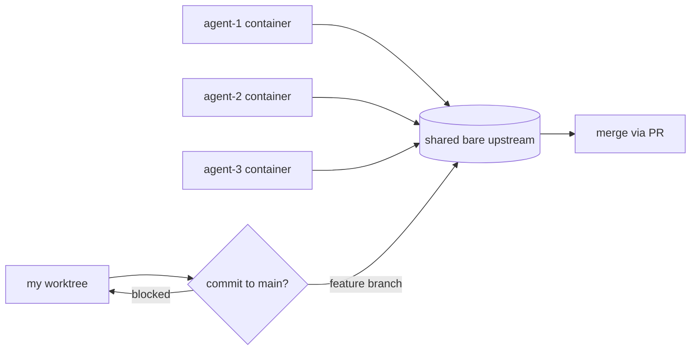
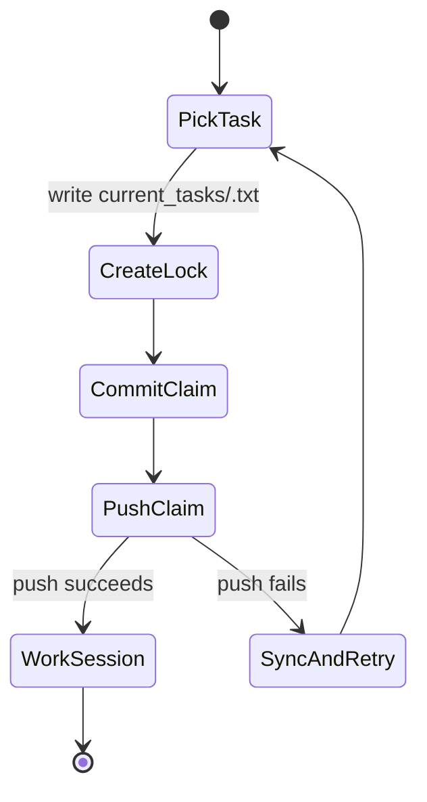

The first time I ran multiple Claude Code sessions against the same repository, the failure mode was obvious: they shared the same working tree, the same index, and the same idea that `main` was a reasonable place to put work.

That does not scale. Two agents editing the same checkout is not collaboration. It is a race condition with a chat interface. My fix has two halves — give each agent an isolated workspace, and put a hard guard at the one boundary where mistakes become shared history.



### Isolated workspaces via Docker

`agent-teams-setup` runs each agent in its own Docker container. On startup the container configures Git and clones the shared upstream into a private `/workspace`, so the file system state is isolated even though the history is shared.

```bash
# scripts/agent-entrypoint.sh
git config --global user.name "$AGENT_ID"
git config --global user.email "${AGENT_ID}@agent-teams.local"
git config --global pull.rebase true
git config --global merge.conflictstyle diff3
git config --global rerere.enabled true

git clone /upstream /workspace
cd /workspace
```

`spawn-agents.sh` turns the team config into containers, mounting the same `/upstream` into each one. That small separation matters: an agent can run formatters, write temp files, and inspect its own dirty state without touching another agent's index.

### Coordinating through Git, not each other

The agents never talk to each other directly. They coordinate through Git. To claim work, an agent writes a lock file under `current_tasks/`, commits it, and pushes. If the push fails, someone else claimed it first — Git push atomicity is the lock.



The loop also treats sync as a normal operation, not an exceptional one. It pulls before each session, and falls back to a hard reset only when a rebase cannot apply cleanly.

```bash
git pull --rebase origin main 2>/dev/null || {
    git rebase --abort 2>/dev/null || true
    git reset --hard origin/main 2>/dev/null || true
    git pull origin main 2>/dev/null || true
}

if [ -n "$(git status --porcelain 2>/dev/null)" ]; then
    git add -A
    git commit -m "[$AGENT_ID] wip: auto-save from session #$SESSION_COUNT" 2>/dev/null || true
    /scripts/sync-upstream.sh 2>/dev/null || true
fi
```

### The guard at the git boundary

Docker agents coordinate through the shared upstream, but my own terminal still needs one hard rule: never commit directly to `main`. A plain pre-commit hook is not enough — an agent (or I) can pass `--no-verify`, delete the hook, or work in a fresh clone. So `wtguard` stacks three independent layers behind one install:

1. A `git` proxy placed first on `PATH`, which catches `--no-verify` and a missing hook.
2. The pre-commit hook itself, for when the proxy is bypassed (`/usr/bin/git` called directly).
3. Opt-in GitHub branch protection — server-side, and unbypassable.

Each layer alone is bypassable. All three together are not. What keeps them honest is that they all ask the same question, answered by one pure function with no Git calls of its own:

```go
// internal/guard/guard.go — the single source of truth,
// called by the proxy and the pre-commit hook
func Decide(r Rule) Decision {
	if r.BypassEnv {
		return Decision{Block: false, Reason: "bypass env set"}
	}
	if r.Detached {
		return Decision{Block: false, Reason: "detached HEAD"}
	}
	if !slices.Contains(r.ProtectedList, r.Branch) {
		return Decision{Block: false, Reason: "branch not protected"}
	}
	// default policy "always": refuse any commit to a protected branch
	return Decision{Block: true, Reason: "branch is protected"}
}
```

The caller precomputes the `Rule` — branch, detached state, worktree count, protected list — so `Decide` stays a pure function I can unit-test without a repo. A second policy, `worktree-active`, only blocks when an extra worktree is open, for people who want the guard to step aside when they are genuinely working alone.

None of these pieces is clever by itself. Agents get isolated workspaces, tasks get lock files, pushes go through a rebase path, and my own commits hit a guard at the git boundary. Together they turn parallel agent work from "hope nothing collides" into something I can leave running. It is one more small piece of the Claude Code setup I keep sharpening, like [the zsh plugin that resumes the right session](/posts/zsh-claude-resume).
