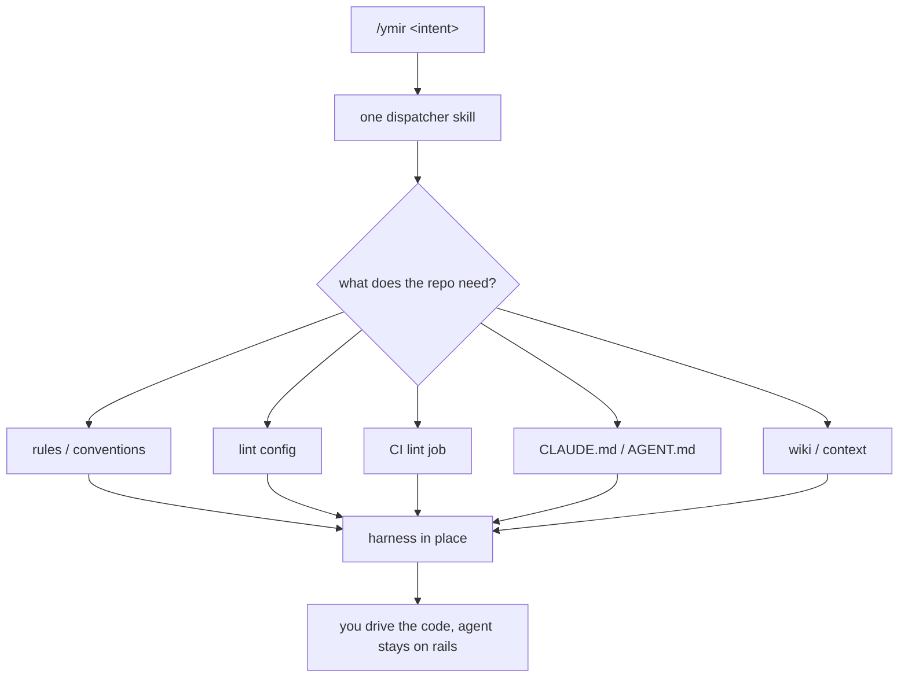

The slow part of starting a repo was never the code. It was everything around it: a `CLAUDE.md` to steer the agent, a linter, a CI job to run that linter, and somewhere sane to keep the decisions I'd already made. I rebuilt that by hand every time, and the times I rushed it the agent drifted — re-litigating choices, sprawling files I never asked for.

Ymir is the plugin I built so I stop doing that. You tell it the shape of the project; it lays the harness and nothing else. The actual code is still yours to drive through Claude Code — Ymir just makes sure the agent starts on rails.



### Use case 1 — a fresh repo on day one

`/ymir init for this project` is the whole bootstrap. It runs a short interview — language, frontend or backend, the few things that actually change the templates — and then scaffolds each harness piece that fits the answers. No copying a starter repo, no porting last project's config. The output is a skeleton, never application code.

### Use case 2 — patching one thing into an existing repo

I don't always want the full treatment. A repo that already has CI but no convention doc just needs rules. So Ymir isn't a fixed menu — it's one skill that reads whatever you typed as the intent:

```
ymir add lint for this project
ymir add context
ymir set up CI
```

A narrow ask only triggers the questions that action needs. That's the part I find quietly important: there's no command list to memorize and no flags to look up. You say what you want in English, and the skill maps it to a harness concern and acts on the current directory.

### Use case 3 — knowledge that doesn't rot

The piece I shipped first is `wiki/context`: a small, LLM-maintained knowledge base for the project. The point isn't the markdown tree — it's that the agent can't free-form edit it. Every change goes through a CLI that validates and logs, so the project's accumulated decisions stay structured instead of decaying into stale notes. The agent reads it, searches it, and writes to it only through the sanctioned path. (The internals of that guard are in [the first Ymir post](/posts/ymir-claude-code-harness) if you want them.)

### Why one skill instead of a toolbox

The design bet is that a harness is a small, fixed set of concerns — rules, lint, CI, context, the steering file — and the variation is only in _how_ each maps to your stack. So Ymir doesn't need a sprawling command surface. It needs one skill that understands intent and a set of templates behind it.

It's early — `v0.2.0`, with the wiki concern real and lint/CI/rules still stubbed. But the division of labor is the whole idea: Ymir owns the setup so the agent can own the code, and neither one steps on the other.
