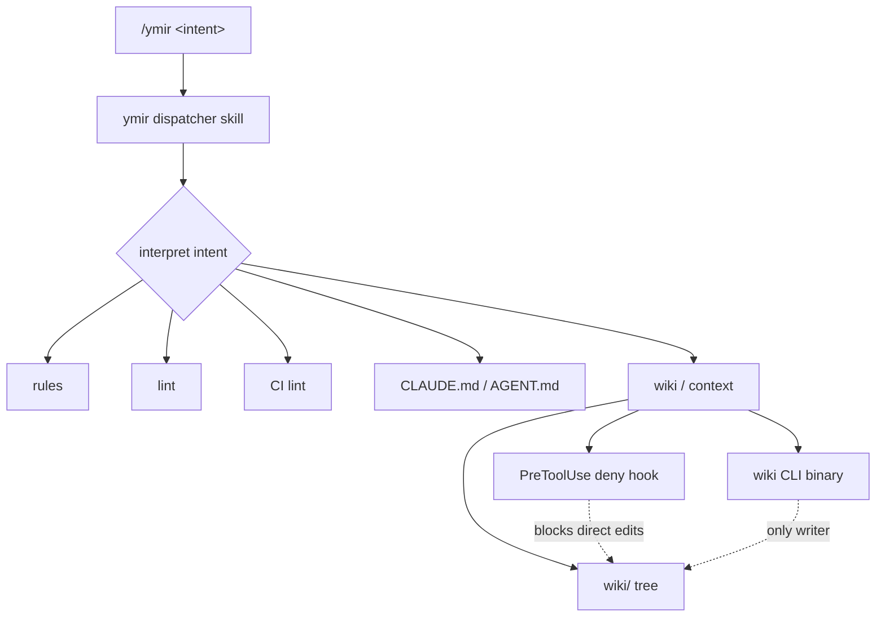
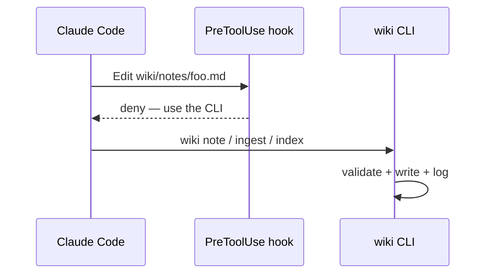

Every new repo starts the same way: a `CLAUDE.md`, a linter config, a CI job to run it, some convention for where project knowledge lives. I kept rebuilding that scaffolding by hand, and when I skipped it the agent drifted — re-deriving decisions I'd already made, editing notes it should have left alone.

Ymir is my fix. It's a Claude Code plugin marketplace plus a single plugin that scaffolds the **harness** a repo should start with — and deliberately stops there. It never writes application code. It interviews you about the stack, lays down the skeleton, and then you drive the real work through Claude Code, steered by what Ymir put down.



### One skill, not a command list

Ymir isn't a fixed menu of commands. It's one dispatcher skill, and whatever you type after `ymir` is the intent:

```
ymir init for this project
ymir add lint for this project
ymir add context
```

The skill reads `$ARGUMENTS`, maps it to a harness concern, and acts on the current directory. The frontmatter description is the whole routing table:

```markdown
description: Ymir scaffolds a project's harness skeleton for THIS project —
rules, lint, CI lint, wiki/context, and CLAUDE.md/AGENT.md. ...
Interviews the user about their techstack and builds only the skeleton —
never application code.
```

`init` runs the full interview; a narrow action like `add lint` asks only the questions that action needs.

### The piece I shipped first: a wiki the agent can't hand-edit

Most of the harness is still stubbed, but the **wiki/context** concern is real, and it's the part I find most interesting. `ymir add context` scaffolds a `wiki/` tree and installs a `PreToolUse` hook. The hook's job is to _deny_ the agent write access to its own knowledge base:

```javascript
const blocked =
  /\/wiki\/sources\//.test(norm) ||
  /\/wiki\/notes\//.test(norm) ||
  /\/wiki\/index\.md$/.test(norm) ||
  /\/wiki\/log\.md$/.test(norm);

if (blocked) {
  process.stdout.write(
    JSON.stringify(
      {
        hookSpecificOutput: {
          hookEventName: "PreToolUse",
          permissionDecision: "deny",
          permissionDecisionReason:
            "Wiki docs are CLI-managed. Use the Ymir wiki CLI ...",
        },
      },
      null,
      2
    )
  );
}
```

The point isn't to fight the agent — it's to force every wiki mutation through a CLI that validates schema and appends a log, instead of free-form edits that rot. Raw notes and the schema doc stay editable; the curated docs don't.



### Shipping the binary without asking you to build it

The wiki CLI is a compiled binary. A `SessionStart` hook checks the version stamp and, on mismatch, downloads the right asset for your platform from the GitHub release:

```javascript
const label = detectAssetLabel(execSync("uname -sm", { encoding: "utf8" }));
const base = `https://github.com/muitneliss/ymir/releases/download/v${pluginVersion}`;
const assetUrl = `${base}/wiki-${label}`;
```

It verifies the SHA256 before swapping it in. Install the plugin, start a session, and the tool is just there.

It's `v0.2.0` — the interview and the lint/CI/rules pieces are next. But the shape is set: Ymir owns the scaffolding so the agent can own the code. If you've read [wtguard](/posts/wtguard-parallel-agents), this is the same instinct — put guardrails in the harness, not in your own discipline.
