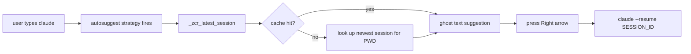
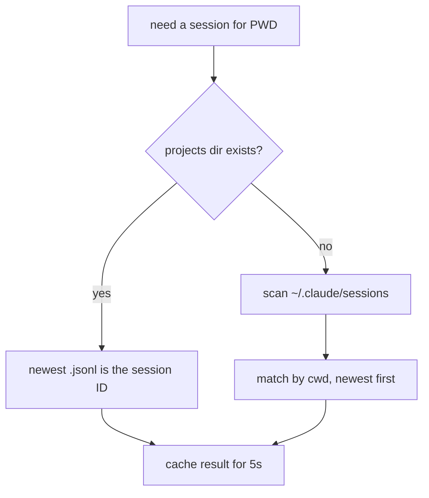

I restart Claude Code a lot — jump between projects, close terminals, open panes, come back later with only a vague memory that a useful session existed somewhere.

`claude --resume`, pick from a list, continue: fine once. All day, it is friction in the wrong place. I do not want to think about session IDs. I want the shell to notice which project directory I am in and offer the most recent session for it.



`zsh-claude-resume` stays small: pure zsh, POSIX tools, no `jq`, no Python, no daemon. Two jobs — a `zsh-autosuggestions` strategy that shows the resume command as ghost text, and tab completion for `claude --resume`.

### The session lookup

Claude stores project sessions under a path derived from `PWD`, so the plugin turns slashes and dots into dashes and looks there first — behind a short-lived cache, since autosuggestion hooks run on every keystroke.

```zsh
_zcr_latest_session() {
    local now=${EPOCHSECONDS:-$(command date +%s)}
    local cache_val="${_zcr_session_cache[$PWD]}"

    if [[ -n "$cache_val" ]]; then
        local cache_time="${cache_val%% *}"
        local cache_id="${cache_val#* }"
        if (( now - cache_time < ZSH_CLAUDE_RESUME_CACHE_TTL )); then
            print -r -- "$cache_id"
            return
        fi
    fi

    local project_dir="${HOME}/.claude/projects/${PWD//[\/.]/-}"
    local session_id
```

A five-second TTL avoids lag without making the shell feel stale.

### Handling both storage layouts

It handles two layouts: newer JSONL files under the project directory, and older PID session files under `~/.claude/sessions`. Cheap path first, fall back only if the project directory is missing.

```zsh
if [[ -d "$project_dir" ]]; then
    local latest
    latest=$(command ls -t "$project_dir" 2>/dev/null | command grep -vE "^(sessions-index\.json|memory)$" | command head -1)
    [[ -n "$latest" ]] && session_id="${latest%.jsonl}"
fi
```



### Flag detection

I run Claude with the same flags per project. The plugin scans recent zsh history for the most common plain `claude ...` invocation, so if that was `claude --dangerously-skip-permissions`, the suggestion keeps it.

```zsh
most_common=$(print -r -- "$hist_source" | \
    command grep -E "^claude " | \
    command grep -vE "(--resume|--continue| -r | -c |mcp |doctor|setup|update|config )" | \
    command sed 's/^ *//;s/ *$//' | \
    LC_ALL=C command sort | LC_ALL=C command uniq -c | LC_ALL=C command sort -rn | \
    command head -1 | command sed 's/^ *[0-9]* *//')
```

### The autosuggestion strategy

The suggestion is just string matching. If the buffer starts with `claude`, build the best resume candidate and expose it as `suggestion` for `zsh-autosuggestions` to render.

```zsh
_zsh_autosuggest_strategy_claude_resume() {
    typeset -g suggestion=""

    [[ "$1" != claude* ]] && return

    local session_id
    session_id=$(_zcr_latest_session) || return

    local with_flags="claude${_zcr_common_flags} --resume ${session_id}"
    local bare="claude --resume ${session_id}"

    if [[ "$with_flags" == "$1"* ]]; then
        suggestion="$with_flags"
    elif [[ "$bare" == "$1"* ]]; then
        suggestion="$bare"
    fi
}
```

### Setup

Setup is registration — prepend the strategy to `zsh-autosuggestions`, wire up completion:

```zsh
_zcr_detect_flags

if [[ -n "$ZSH_AUTOSUGGEST_STRATEGY" ]] || (( ${+functions[_zsh_autosuggest_strategy_default]} )); then
    ZSH_AUTOSUGGEST_STRATEGY=(claude_resume "${ZSH_AUTOSUGGEST_STRATEGY[@]}")
fi

compdef _zcr_complete_claude claude
```

This is the kind of tool I like most: it removes one repeated thought. Type `claude`, press right arrow when the suggestion looks right, and I am back in the session that already had the context. Same itch as [wtguard](/posts/wtguard-parallel-agents), the guard that keeps my parallel agents off `main` — small pieces of a Claude Code setup I keep sharpening.
