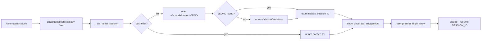
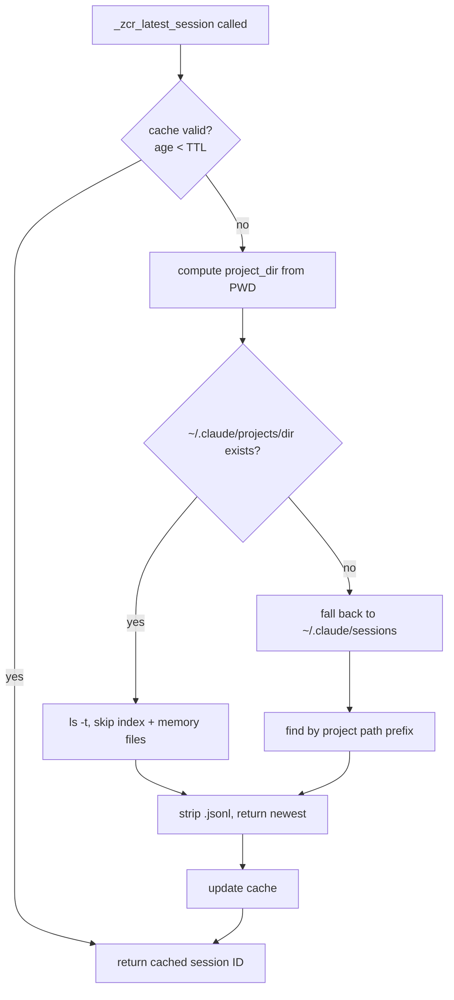

I restart Claude Code a lot. I jump between projects, close terminals, open new panes, and come back later with only a vague memory that there was already a useful session somewhere.

The default workflow is fine once. Run `claude --resume`, pick from a list, continue. After doing that all day, it starts to feel like friction in the wrong place. I do not want to think about session IDs. I want the shell to know that I am standing inside a project directory and offer the most recent session for that directory.

> **Key Takeaways**
> - The plugin adds a custom `zsh-autosuggestions` strategy so typing `claude` shows the correct `--resume SESSION_ID` as ghost text — press right arrow to accept.
> - A five-second TTL cache prevents the session lookup from running on every keystroke.
> - Flag detection scans your zsh history so the suggestion preserves flags you use regularly, like `--dangerously-skip-permissions`.

## How it works

At a high level, the plugin turns a plain `claude` buffer into a project-aware resume suggestion.



`zsh-claude-resume` is intentionally small: pure zsh, standard POSIX tools, no `jq`, no Python helper, no daemon. It has two jobs: add a `zsh-autosuggestions` strategy so typing `claude` shows the resume command as ghost text, and register tab completion for `claude --resume`.

## The session lookup

The core lookup starts with the current directory. Claude stores project sessions under a path derived from `PWD`, so the plugin turns slashes and dots into dashes and looks inside `~/.claude/projects/...`.

```zsh
_zcr_latest_session() {
    local now=${EPOCHSECONDS:-$(command date +%s)}
    local cache_val="${_zcr_session_cache[$PWD]}"

    if [[ -n "$cache_val" ]]; then
        local cache_time="${cache_val%% *}"
        local cache_id="${cache_val#* }"
        if (( now - cache_time < ZSH_CLAUDE_RESUME_CACHE_TTL )); then
            print -r -- "$cache_id"
            return
        fi
    fi

    local project_dir="${HOME}/.claude/projects/${PWD//[\/.]/-}"
    local session_id
```

The cache exists because autosuggestion hooks run constantly while typing. A five-second TTL avoids lag without making the shell feel stale.

## Handling both storage layouts

The plugin handles both storage layouts I have seen: newer JSONL files under the project directory, and older PID session files under `~/.claude/sessions`. The first path is cheap:

```zsh
if [[ -d "$project_dir" ]]; then
    local latest
    latest=$(command ls -t "$project_dir" 2>/dev/null | command grep -vE "^(sessions-index\.json|memory)$" | command head -1)
    [[ -n "$latest" ]] && session_id="${latest%.jsonl}"
fi
```



## Flag detection

I often run Claude with the same flags in a project, and the plugin scans recent zsh history to find the most common plain `claude ...` invocation. If that command was `claude --dangerously-skip-permissions`, the suggestion preserves it.

```zsh
most_common=$(print -r -- "$hist_source" | \
    command grep -E "^claude " | \
    command grep -vE "(--resume|--continue| -r | -c |mcp |doctor|setup|update|config )" | \
    command sed 's/^ *//;s/ *$//' | \
    LC_ALL=C command sort | LC_ALL=C command uniq -c | LC_ALL=C command sort -rn | \
    command head -1 | command sed 's/^ *[0-9]* *//')
```

## The autosuggestion strategy

The autosuggestion itself is just string matching. If the current buffer starts with `claude`, build the best resume candidate and expose it as `suggestion`.

```zsh
_zsh_autosuggest_strategy_claude_resume() {
    typeset -g suggestion=""

    [[ "$1" != claude* ]] && return

    local session_id
    session_id=$(_zcr_latest_session) || return

    local with_flags="claude${_zcr_common_flags} --resume ${session_id}"
    local bare="claude --resume ${session_id}"

    if [[ "$with_flags" == "$1"* ]]; then
        suggestion="$with_flags"
    elif [[ "$bare" == "$1"* ]]; then
        suggestion="$bare"
    fi
}
```

## Setup

Setup is just registration — prepend the strategy to `zsh-autosuggestions` and wire up tab completion:

```zsh
_zcr_detect_flags

if [[ -n "$ZSH_AUTOSUGGEST_STRATEGY" ]] || (( ${+functions[_zsh_autosuggest_strategy_default]} )); then
    ZSH_AUTOSUGGEST_STRATEGY=(claude_resume "${ZSH_AUTOSUGGEST_STRATEGY[@]}")
fi

compdef _zcr_complete_claude claude
```

The result is the kind of tool I like most: it removes one repeated thought. I type `claude`, press right arrow when the suggestion looks right, and I am back in the session that already had the context.

---

## FAQ

**Does this require `jq` or any external dependencies?**

No. The plugin uses only pure zsh and standard POSIX tools (`ls`, `grep`, `sed`, `sort`, `uniq`). No `jq`, no Python helper, no background daemon.

**What if I have no session for the current project yet?**

The lookup returns nothing and the suggestion is empty. You get the same experience as plain `claude` with no plugin installed — no errors, no noise.

**Why a TTL cache instead of running the lookup once at shell startup?**

You change directories constantly. A startup-only lookup would show the session for whatever directory you were in when the shell started. The per-`PWD` cache with a short TTL gives you the right session for wherever you are now, without paying the lookup cost on every keystroke.

**What if I use the older `~/.claude/sessions` layout?**

The plugin falls back automatically. It checks the newer project-directory JSONL layout first; if that directory does not exist, it scans `~/.claude/sessions` for a session whose path prefix matches your current `PWD`.
